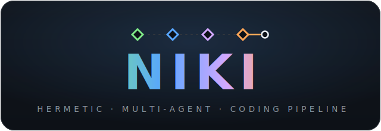
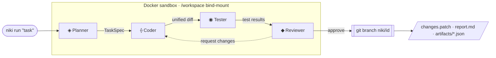

<!--
  NIKI — README
  Logo: GitHub's Markdown sanitizer strips inline <svg>, so the logo is a committed,
  self-contained SVG (assets/logo.svg, its own dark card) referenced via .
  This renders identically in light/dark GitHub themes with no external hosting.
-->

<div align="center">



<br>

**Turn a sentence into a reviewable pull request.**

Four specialized LLM agents — **Planner → Coder → Tester → Reviewer** — collaborate inside a
Docker sandbox and hand you a clean git branch, a diff, and a full audit trail. Your working tree is never touched.

<br>

[](https://www.rust-lang.org/)
[](https://docs.docker.com/get-docker/)
[](#configuration)
[](#license)
[](#roadmap)

<a href="#quick-start"><b>Quick Start</b></a> ·
<a href="#how-it-works"><b>How it works</b></a> ·
<a href="#configuration"><b>Configuration</b></a> ·
<a href="#cli-reference"><b>CLI</b></a> ·
<a href="#roadmap"><b>Roadmap</b></a>

</div>

---

## See it run

Describe a change in plain English. NIKI runs a four-stage agent pipeline in an isolated container and gives you back a branch to review — nothing lands on `main` until you say so.

```bash
niki run "Add a GET /health endpoint returning { status: 'ok', uptime }" --project ./my-app
```

```text
 ◈ ⟠ ◉ ◆   NIKI
   "Add a GET /health endpoint…"

 [Planner]   Done — Spec: 1 file to modify
 [Coder]     Done — Changed 1 file · index.js [modified]
 [Tester]    Done — 8/8 tests passed
 [Reviewer]  Done — Approved · correctness 10/10 · quality 8/10 · coverage 10/10
 [NIKI]      Task complete — Branch: niki/6d281d6d · Verdict: Approved · Revisions: 0
```

Every run leaves behind a `niki/<id>` branch, a `changes.patch`, a human-readable `report.md`, and per-agent JSON artifacts — the entire decision trail is inspectable.

## About

> **Stop babysitting your AI. Let agents debate so you don't have to.**

Today's AI coding tools — Claude Code, Cursor, Devin — run on a **single agent** in one long conversation, which brings three recurring failures:

- **Confirmation bias** — one agent never truly challenges its own assumptions.
- **Context drift** — output quality degrades as the conversation grows.
- **The babysitting tax** — you must constantly steer, correct, and re-verify its work.

NIKI takes a different path. Work is split across **independent agents that can't influence one another** — isolated at both the **filesystem** layer (each runs in its own Docker container against a copy of the repo) and the **context** layer (they share no history; they exchange only typed artifacts). Independence is the whole point: it's what removes the bias a single agent can't escape. You describe the task, the agents debate their way to a result, and you review a finished branch.

**Who it's for** — solo developers, indie hackers, and small teams (2–5) who already use AI coding tools but are tired of the prompt-response loop, and want to delegate complex, multi-file tasks and review a polished result instead.

## Why NIKI

|   |   |
|---|---|
| 🧩 **Multi-agent, not monolithic** | Planning, coding, testing, and review are separate agents with their own prompts and models — each does one job well, instead of one model doing everything at once. |
| 🔒 **Hermetic by default** | All work happens in a Docker sandbox bind-mounted to a *copy* of your project. Your working tree is never mutated mid-run. |
| 🌿 **Output is a git branch** | You get `niki/<id>` with a real commit, a diff, and artifacts — reviewable like any human PR. No opaque auto-commits to `main`. |
| 🔑 **BYOK & provider-mixing** | Bring your own keys. Give each agent a different provider/model — a strong reasoner for Planner/Reviewer, a cheap model for Tester. |
| 🔁 **Reviewer-driven revisions** | The Reviewer can bounce work back to the Coder for up to `max_revision_rounds` before completion. |
| 📓 **Fully auditable** | `report.md`, `changes.patch`, and `artifacts/*.json` capture what every agent decided, and why. |

## How it works



1. **Planner** reads the task plus current file contents and produces a `TaskSpec` — which files to touch, and the approach.
2. **Coder** emits a unified diff, applied to the bind-mounted workspace inside the sandbox.
3. **Tester** generates and runs tests against the change.
4. **Reviewer** issues a verdict; on *request-changes* it loops back to the Coder until approved or `max_revision_rounds` is reached.
5. NIKI captures the working-tree diff, commits it to a fresh `niki/<id>` branch, and writes the artifacts.

## Quick Start

**Prerequisites:** [Rust](https://www.rust-lang.org/tools/install) (2024 edition) · [Docker](https://docs.docker.com/get-docker/) running · an API key for at least one LLM provider.

```bash
# 1 · Clone & build
git clone https://github.com/RavaniRoshan/niki.git
cd niki
cargo build --release

# 2 · Build the sandbox image (git, node, npm, python3 pre-baked)
docker build -t niki-sandbox:24.04 -f docker/Dockerfile .

# 3 · Configure — copy the example and add a key
cp niki.example.toml niki.toml
export ANTHROPIC_API_KEY=sk-ant-...   # or OPENAI_API_KEY / GOOGLE_API_KEY

# 4 · Run your first task
./target/release/niki run "Add a /health endpoint" --project /path/to/your/project

# 5 · Review the result
git -C /path/to/your/project switch niki/<id>
niki report <id>                      # full report, or a unique short prefix
```

## Configuration

NIKI reads `niki.toml` from the project root. Keys can also come from environment variables (`ANTHROPIC_API_KEY`, `OPENAI_API_KEY`, `GOOGLE_API_KEY`) — **env vars take precedence, so secrets never have to be committed.**

```toml
[general]
max_revision_rounds = 3        # Reviewer → Coder feedback loops before forced completion
output_dir = ".niki"           # where task artifacts are written

# Per-agent model assignment — mix providers freely
[agents.planner]
provider = "anthropic"
model    = "claude-sonnet-4-20250514"   # best reasoning for planning

[agents.coder]
provider = "anthropic"
model    = "claude-sonnet-4-20250514"

[agents.tester]
provider = "openai"
model    = "gpt-4o-mini"                # cheaper model for test generation

[agents.reviewer]
provider = "anthropic"
model    = "claude-sonnet-4-20250514"   # best reasoning for review

[docker]
base_image     = "niki-sandbox:24.04"
extra_packages = ["nodejs", "npm", "python3"]
memory_limit   = "2g"
cpu_limit      = 2.0
```

Supported providers: **Anthropic · OpenAI · Google · Ollama** — plus any OpenAI/Anthropic-compatible gateway (e.g. OpenRouter) via `base_url`.

## CLI Reference

| Command | Description |
|---|---|
| `niki run <description>` | Run the full pipeline on a task. Key flags: `--project`, `--branch`, `--max-rounds`, `--dry-run`, `--quiet`, `--verbose`, `--<agent>-model`. |
| `niki status` | Show the current/most recent task — status, branch, verdict, revisions. Accepts `--project`. |
| `niki report [id]` | Print a completed task's report. Accepts a full UUID **or a unique short prefix**; `--project`. |
| `niki config` | Manage configuration. |

Run `niki <command> --help` for the full flag list.

## Project Structure

```text
src/
├── agents/        # Planner, Coder, Tester, Reviewer
├── orchestrator/  # pipeline sequencing + task state
├── sandbox/       # Docker container lifecycle & exec
├── llm/           # provider clients (anthropic, openai, google, ollama)
├── output/        # git branch/commit, patch, report generation
├── artifacts/     # typed artifacts + JSON-schema validation
├── knowledge/     # repository indexing for agent context
├── config/        # niki.toml loading & env overrides
├── display/       # streaming TUI + non-TTY log fallback
└── cli/           # run / status / report / config
prompts/           # externalized agent prompts (*.md)
docker/            # sandbox image (Dockerfile) + scripts/
```

## Roadmap

- [ ] Multi-round revision-loop hardening & metrics
- [ ] Broader language / toolchain presets in the sandbox image
- [ ] Richer diff-review UX in `niki report`
- [ ] Cost / token accounting per task
- [ ] Parallel multi-file agent execution

## Contributing

Issues and PRs are welcome. Please keep `cargo build` warning-free and keep secrets out of commits — `niki.toml` and the `.niki/` artifact directory are git-ignored by default.

## License

Licensed under the **Business Source License 1.1 (BUSL-1.1)**. See [`Cargo.toml`](Cargo.toml) for the declared license; a full `LICENSE` file should accompany distribution.

---

<div align="center">
<sub>The name <b>NIKI</b> carries personal meaning to its founder. · Built in Rust 🦀 · Runs anywhere Docker does 🐳</sub>
</div>
