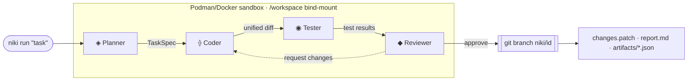

<!--
  NIKI — README
  Logo: GitHub's Markdown sanitizer strips inline <svg>, so the logo is a committed,
  self-contained SVG (assets/logo.svg, its own dark card) referenced via .
  This renders identically in light/dark GitHub themes with no external hosting.
-->

<div align="center">


<br>

**One sentence in, a verified pull request out.**

Four independent LLM agents — **Planner → Coder → Tester → Reviewer** — run in hermetic
sandboxes and hand you a reviewable `niki/<id>` branch with a full audit trail.
Your working tree is never touched.

<br>

[](https://www.rust-lang.org/)
[](https://github.com/RavaniRoshan/niki/actions/workflows/ci.yml)
[](CONTRIBUTING.md)
[](#sandbox)
[](#configuration)
[](LICENSE)
[](#roadmap)

<a href="#quick-start"><b>Quick Start</b></a> ·
<a href="#how-it-works"><b>How it works</b></a> ·
<a href="#why-niki"><b>Why Niki</b></a> ·
<a href="#configuration"><b>Configuration</b></a> ·
<a href="#cli-reference"><b>CLI</b></a> ·
<a href="#roadmap"><b>Roadmap</b></a>

</div>

---

## See it run

<p align="center">
  
</p>

Describe a change in plain English. NIKI runs a four-stage agent pipeline in an isolated container and gives you back a branch to review — nothing lands on `main` until you say so.

```bash
niki run "Add a GET /health endpoint returning { status: 'ok', uptime }" --project ./my-app
```

```text
 ◈ ⟠ ◉ ◆   NIKI
   "Add a GET /health endpoint…"

 [Planner]   Done — Spec: 1 file to modify
 [Coder]     Done — Changed 1 file · index.js [modified]
 [Tester]    Done — 8/8 tests passed
 [Reviewer]  Done — Approved · correctness 10/10 · quality 8/10 · coverage 10/10
 [NIKI]      Task complete — Branch: niki/6d281d6d · Verdict: Approved · Revisions: 0
```

Every run leaves behind a `niki/<id>` branch, a `changes.patch`, a human-readable `report.md`, and per-agent JSON artifacts — the entire decision trail is inspectable.

> **Proof, not promises.** Every claim about NIKI is backed by artifacts NIKI itself produces. Each run writes a `report.md` plus per-agent JSON artifacts (`artifacts/*.json`) capturing exactly what every agent decided and why — the entire decision trail is inspectable and reproducible. See the `docs/launch-audit.md` for the methodology and honest findings behind NIKI's design.

## Why Niki

> **Stop babysitting your AI. Let agents debate so you don't have to.**

Today's AI coding tools — Cursor, Devin — run on a **single agent** in one long conversation, which brings three recurring failures:

- **Confirmation bias** — one agent never truly challenges its own assumptions.
- **Context drift** — output quality degrades as the conversation grows.
- **The babysitting tax** — you must constantly steer, correct, and re-verify its work.

Niki takes a different path. Work is split across **independent agents that can't influence one another** — isolated at both the **filesystem** layer (each runs in its own Podman or Docker container against a copy of the repo) and the **context** layer (they share no history; they exchange only typed artifacts). Independence is the whole point: it's what removes the bias a single agent can't escape. You describe the task, the agents debate their way to a result, and you review a finished branch.

**Who it's for** — solo developers, indie hackers, and small teams (2–5) who already use AI coding tools but are tired of the prompt-response loop, and want to delegate complex, multi-file tasks and review a polished result instead.

|   |   |
|---|---|
| 🧩 **Multi-agent, not monolithic** | Planning, coding, testing, and review are separate agents with their own prompts and models — each does one job well, instead of one model doing everything at once. |
| 🔒 **Hermetic by default** | All work happens in a Podman or Docker sandbox bind-mounted to a *copy* of your project. Your working tree is never mutated mid-run. |
| 🌿 **Output is a git branch** | You get `niki/<id>` with a real commit, a diff, and artifacts — reviewable like any human PR. No opaque auto-commits to `main`. |
| 🔑 **BYOK & provider-mixing** | Bring your own keys. Give each agent a different provider/model — a strong reasoner for Planner/Reviewer, a cheap model for Tester. |
| 🔁 **Reviewer-driven revisions** | The Reviewer can bounce work back to the Coder for up to `max_revision_rounds` before completion. |
| 📓 **Fully auditable** | `report.md`, `changes.patch`, and `artifacts/*.json` capture what every agent decided, and why. |

## How it works


```mermaid
flowchart LR
    U(["niki run &quot;task&quot;"]) --> P

    subgraph Sandbox["Podman/Docker sandbox · /workspace bind-mount"]
        direction LR
        P["◈ Planner"] -->|TaskSpec| C["⟠ Coder"]
        C -->|unified diff| T["◉ Tester"]
        T -->|test results| R["◆ Reviewer"]
        R -.->|request changes| C
    end

    R -->|approve| G[["git branch niki/id"]]
    G --> A["changes.patch · report.md · artifacts/*.json"]
```

1. **Planner** reads the task plus current file contents and produces a `TaskSpec` — which files to touch, and the approach.
2. **Coder** emits a unified diff, applied to the bind-mounted workspace inside the sandbox.
3. **Tester** generates and runs tests against the change.
4. **Reviewer** issues a verdict; on *request-changes* it loops back to the Coder until approved or `max_revision_rounds` is reached.
5. NIKI captures the working-tree diff, commits it to a fresh `niki/<id>` branch, and writes the artifacts.

## Quick Start

**Prerequisites:** [Rust](https://www.rust-lang.org/tools/install) (1.85+) · [Podman](https://podman.io/getting-started/installation) (recommended) or [Docker](https://docs.docker.com/get-docker/) · an API key for one LLM provider.

```bash
# 1 · Install (pick one)
brew install niki                                                              # macOS
curl -fsSL https://raw.githubusercontent.com/RavaniRoshan/niki/master/scripts/install.sh | bash  # Linux/macOS
# Or download a binary: https://github.com/RavaniRoshan/niki/releases/latest

# 2 · Build the sandbox image
podman build -t niki-sandbox:24.04 -f docker/Dockerfile .   # or: docker build ...

# 3 · Configure
cp niki.example.toml niki.toml
export ANTHROPIC_API_KEY=sk-ant-...   # or OPENAI_API_KEY / GOOGLE_API_KEY

# 4 · Run your first task
niki run "Add a /health endpoint" --project /path/to/your/project

# 5 · Review the result
niki report <id>    # full report, or a unique short prefix
```

**First verified branch in under five minutes** once Rust, Podman/Docker, and an API key are in place.

### Verify your setup

```bash
niki doctor               # check install, config, providers, sandbox, security
niki smoke                # run a trivial task to verify end-to-end
```

## Configuration

Niki reads `niki.toml` from the project root. Keys can also come from environment variables (`ANTHROPIC_API_KEY`, `OPENAI_API_KEY`, `GOOGLE_API_KEY`) — **env vars take precedence, so secrets never have to be committed.**

Provider `base_url` and `model` likewise follow standard conventions and can be set from the environment, overriding `niki.toml`: `ANTHROPIC_BASE_URL` / `ANTHROPIC_MODEL` and `OPENAI_BASE_URL` / `OPENAI_MODEL`.

```toml
[general]
max_revision_rounds = 3
spend_cap_usd = 5.0          # NIKI aborts if est. cost exceeds this

# Per-agent model assignment — mix providers freely
[agents.planner]
provider = "anthropic"
model    = "claude-sonnet-4-20250514"

[agents.coder]
provider = "anthropic"
model    = "claude-sonnet-4-20250514"

[agents.tester]
provider = "openai"
model    = "gpt-4o-mini"     # cheaper model for test generation

[agents.reviewer]
provider = "anthropic"
model    = "claude-sonnet-4-20250514"
```

Supported providers: **Anthropic · OpenAI · Google · Ollama** — plus any OpenAI/Anthropic-compatible gateway via `base_url`.

### Advanced

| Feature | Config | Docs |
|---|---|---|
| Custom pipeline topology | `[pipeline]` | `docs/content/06-configuration/` |
| Parallel coders + synthesis | `[parallel]` | `docs/content/02-agent-pipeline/06-specialized-agents.mdx` |
| External source ingestion | `[knowledge]` | `docs/content/06-configuration/` |
| Security audit pass | `[security]` | `docs/content/03-sandboxing-security/` |
| Adversarial Red review | `[red_blue]` | `docs/content/02-agent-pipeline/06-specialized-agents.mdx` |
| MCP server integration | `[mcp]` | `docs/content/06-configuration/` |
| Permissions model | `[permissions]` | `docs/content/03-sandboxing-security/` |

### Sandbox backends

Niki defaults to Podman (rootless, no daemon) with a Docker fallback. A git-worktree backend is also available (no container runtime required):

```bash
niki run "..." --backend worktree   # no container runtime
```

### Security & privacy

- **No telemetry.** Only outbound traffic is your LLM API calls (or local Ollama).
- **Sandboxed by default.** Rootless container with CapDrop ALL, read-only rootfs.
- **Your keys, never bundled.** BYOK only; keys redacted from logs and reports.
- **Spend cap enforced.** Aborts before branch creation if cost exceeds limit.
- **Audit trail.** Per-agent artifacts, metrics, and `safety_proof.json` for every run.

## CLI Reference

| Command | Description |
|---|---|
| `niki run <description>` | Run the pipeline. Flags: `--project`, `--branch`, `--max-rounds`, `--backend`, `--tui`. |
| `niki status` | Current/most recent task status. |
| `niki report [id]` | Print a task's report (UUID or short prefix). |
| `niki doctor` | Diagnostics: install, config, providers, sandbox, security. |
| `niki smoke` | Quick pipeline verification. |
| `niki chat` | Interactive TUI session. |
| `niki config` | Manage configuration. |
| `niki recommend` | Per-agent model recommendations. |
| `niki dashboard [id]` | Static HTML diff viewer. |
| `niki eval` | Evaluation harness on seeded-defect dataset. |
| `niki auth` | Manage API credentials. |
| `niki providers` | Check LLM provider configurations. |
| `niki memory` | View agent memory. |
| `niki goal` | Manage persistent goals. |

Run `niki <command> --help` for full flags.

## Project Structure

```text
src/
├── agents/        # Planner, Coder, Tester, Reviewer
├── orchestrator/  # pipeline sequencing + task state
├── sandbox/       # Sandbox trait: Podman/Docker / git-worktree backends
├── llm/           # provider clients (anthropic, openai, google, ollama)
├── runtime/       # tool registry + 22 baseline tools
├── mission/       # mission/session/agent stores
├── activity/      # agent state grammar (12 states)
├── event/         # event bus (typed domain events)
├── persistence/   # mission-scoped JSON storage
├── output/        # git branch/commit, patch, report generation
├── artifacts/     # typed artifacts + JSON-schema validation
├── knowledge/     # repository indexing for agent context
├── config/        # niki.toml loading & env overrides
├── display/       # streaming TUI + non-TTY log fallback
└── cli/           # run / status / report / config
prompts/           # externalized agent prompts (*.md)
docker/            # sandbox image (Dockerfile)
```

## What Niki is NOT

- **Not a replacement for your judgment.** You review the diff and `report.md` before merging.
- **Not a single all-knowing agent.** Four independent agents, each with narrower context windows.
- **Not training on your code.** BYOK, no telemetry, no hosted service.
- **Not magic on huge codebases.** Works best on tasks with a clear spec and testable outcome.

## Roadmap

### v0.4.0 (shipped)
- [x] Cost & performance analytics
- [x] User-defined pipeline topologies
- [x] Parallel coders + synthesis
- [x] Security Auditor agent
- [x] External source ingestion
- [x] Rich terminal TUI
- [x] Dashboard (diff viewer)
- [x] Git worktree backend
- [x] Per-agent model recommendations

### Later
- [ ] Cloud execution (beta)
- [ ] Living memory · pipeline marketplace
- [ ] Architect agent · Enterprise tier

See [`docs/distribution-plan.md`](docs/distribution-plan.md) for the full plan.

## Contributing

Issues and PRs are welcome. Please keep `cargo build` warning-free and keep secrets out of commits — `niki.toml` and the `.niki/` artifact directory are git-ignored by default.

See [`CONTRIBUTING.md`](CONTRIBUTING.md) for the workflow.

## License

Niki is **free and open source**, licensed under the **Apache License 2.0** — see [`LICENSE`](LICENSE).

- Use, modify, redistribute in production (including with your own API keys).
- Contributions welcome under the same license.

---

<div align="center">
<sub>The name <b>NIKI</b> carries personal meaning to its founder. · Built in Rust 🦀 · Runs anywhere Podman or Docker does 🐳</sub>
</div>
