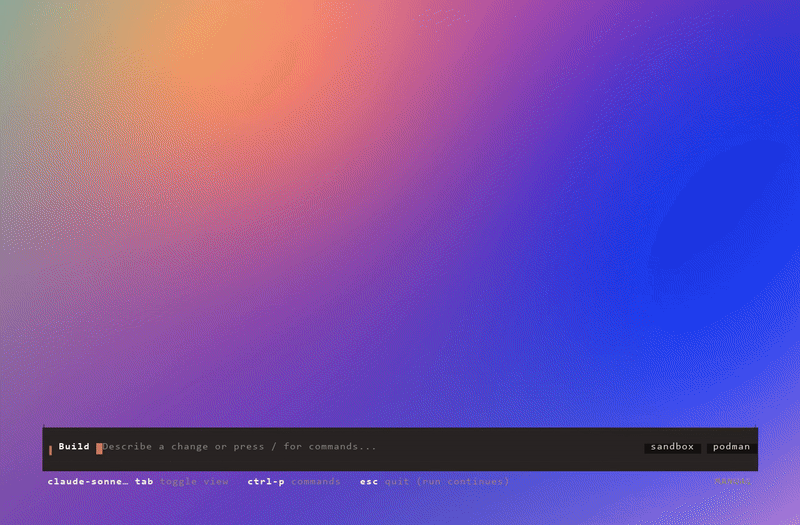

<!--
  NIKI — README
  Logo: GitHub's Markdown sanitizer strips inline <svg>, so the logo is a committed,
  self-contained SVG (assets/logo.svg, its own dark card) referenced via .
  This renders identically in light/dark GitHub themes with no external hosting.
-->

<div align="center">


<br>

**Turn a sentence into a verified pull request.**

Four specialized LLM agents — **Planner → Coder → Tester → Reviewer** — collaborate inside a
Podman or Docker sandbox and hand you a verified git branch, a diff, and a full audit trail. Your working tree is never touched.

<br>

[](https://www.rust-lang.org/)
[](https://github.com/RavaniRoshan/niki/actions/workflows/ci.yml)
[](CONTRIBUTING.md)
[](#sandbox)
[](#configuration)
[](LICENSE)
[](#roadmap)

<a href="#quick-start"><b>Quick Start</b></a> ·
<a href="#how-it-works"><b>How it works</b></a> ·
<a href="#configuration"><b>Configuration</b></a> ·
<a href="#cli-reference"><b>CLI</b></a> ·
<a href="#roadmap"><b>Roadmap</b></a>

</div>

---

## See it run

<p align="center">
  
</p>

Describe a change in plain English. NIKI runs a four-stage agent pipeline in an isolated container and gives you back a branch to review — nothing lands on `main` until you say so.

```bash
niki run "Add a GET /health endpoint returning { status: 'ok', uptime }" --project ./my-app
```

```text
 ◈ ⟠ ◉ ◆   NIKI
   "Add a GET /health endpoint…"

 [Planner]   Done — Spec: 1 file to modify
 [Coder]     Done — Changed 1 file · index.js [modified]
 [Tester]    Done — 8/8 tests passed
 [Reviewer]  Done — Approved · correctness 10/10 · quality 8/10 · coverage 10/10
 [NIKI]      Task complete — Branch: niki/6d281d6d · Verdict: Approved · Revisions: 0
```

Every run leaves behind a `niki/<id>` branch, a `changes.patch`, a human-readable `report.md`, and per-agent JSON artifacts — the entire decision trail is inspectable.

> **Proof, not promises.** Every claim about NIKI is backed by artifacts NIKI itself produces. Each run writes a `report.md` plus per-agent JSON artifacts (`artifacts/*.json`) capturing exactly what every agent decided and why — the entire decision trail is inspectable and reproducible. See the `research/` directory for the methodology and honest findings behind NIKI's design.

## About

> **Stop babysitting your AI. Let agents debate so you don't have to.**

Today's AI coding tools — Cursor, Devin — run on a **single agent** in one long conversation, which brings three recurring failures:

- **Confirmation bias** — one agent never truly challenges its own assumptions.
- **Context drift** — output quality degrades as the conversation grows.
- **The babysitting tax** — you must constantly steer, correct, and re-verify its work.

NIKI takes a different path. Work is split across **independent agents that can't influence one another** — isolated at both the **filesystem** layer (each runs in its own Podman or Docker container against a copy of the repo) and the **context** layer (they share no history; they exchange only typed artifacts). Independence is the whole point: it's what removes the bias a single agent can't escape. You describe the task, the agents debate their way to a result, and you review a finished branch.

**Who it's for** — solo developers, indie hackers, and small teams (2–5) who already use AI coding tools but are tired of the prompt-response loop, and want to delegate complex, multi-file tasks and review a polished result instead.

## Why NIKI

|   |   |
|---|---|
| 🧩 **Multi-agent, not monolithic** | Planning, coding, testing, and review are separate agents with their own prompts and models — each does one job well, instead of one model doing everything at once. |
| 🔒 **Hermetic by default** | All work happens in a Podman or Docker sandbox bind-mounted to a *copy* of your project. Your working tree is never mutated mid-run. |
| 🌿 **Output is a git branch** | You get `niki/<id>` with a real commit, a diff, and artifacts — reviewable like any human PR. No opaque auto-commits to `main`. |
| 🔑 **BYOK & provider-mixing** | Bring your own keys. Give each agent a different provider/model — a strong reasoner for Planner/Reviewer, a cheap model for Tester. |
| 🔁 **Reviewer-driven revisions** | The Reviewer can bounce work back to the Coder for up to `max_revision_rounds` before completion. |
| 📓 **Fully auditable** | `report.md`, `changes.patch`, and `artifacts/*.json` capture what every agent decided, and why. |

## How it works

```mermaid
flowchart LR
    U([niki run "task"]) --> P

    subgraph Sandbox [ Podman/Docker sandbox · /workspace bind-mount ]
        direction LR
        P[◈ Planner] -->|TaskSpec| C[⟠ Coder]
        C -->|unified diff| T[◉ Tester]
        T -->|test results| R[◆ Reviewer]
        R -.->|request changes| C
    end

    R -->|approve| G[[git branch niki/id]]
    G --> A[/changes.patch · report.md · artifacts/*.json/]
```

1. **Planner** reads the task plus current file contents and produces a `TaskSpec` — which files to touch, and the approach.
2. **Coder** emits a unified diff, applied to the bind-mounted workspace inside the sandbox.
3. **Tester** generates and runs tests against the change.
4. **Reviewer** issues a verdict; on *request-changes* it loops back to the Coder until approved or `max_revision_rounds` is reached.
5. NIKI captures the working-tree diff, commits it to a fresh `niki/<id>` branch, and writes the artifacts.

## Quick Start

**Prerequisites:** [Rust](https://www.rust-lang.org/tools/install) (2024 edition) · [Podman](https://podman.io/getting-started/installation) (recommended) or [Docker](https://docs.docker.com/get-docker/) running · an API key for at least one LLM provider.

```bash
# 1 · Clone & build
git clone https://github.com/RavaniRoshan/niki.git
cd niki
cargo build --release

# 2 · Build the sandbox image (Wolfi/Chainguard base, git/node/npm/python3 pre-baked)
podman build -t niki-sandbox:24.04 -f docker/Dockerfile .   # or: docker build ...

# 3 · Configure — copy the example and add a key
cp niki.example.toml niki.toml
export ANTHROPIC_API_KEY=sk-ant-...   # or OPENAI_API_KEY / GOOGLE_API_KEY

# 4 · Run your first task
./target/release/niki run "Add a /health endpoint" --project /path/to/your/project

# 5 · Review the result
git -C /path/to/your/project switch niki/<id>
niki report <id>                      # full report, or a unique short prefix
```

## Install (one line)

```bash
# macOS (Homebrew)
brew install niki

# Linux / macOS (any — downloads the release archive and verifies its SHA256)
curl -fsSL https://raw.githubusercontent.com/RavaniRoshan/niki/master/scripts/install.sh | bash

# Or download a binary: https://github.com/RavaniRoshan/niki/releases/latest
```

> **Windows:** a native build (Scoop / Winget) is **planned** but not shipped yet.
> Today NIKI runs on Linux and macOS (Intel + Apple Silicon).

Then copy the example config, add your API key, and run:
```bash
cp niki.example.toml niki.toml   # add your key(s)
niki run "Add a health endpoint to src/api.rs"
```

Niki runs the test suite inside the sandbox and records the real result as part of every run's audit trail.
**First verified branch in under five minutes** once Rust, Podman/Docker, and an API key are in place.
Requires Rust **1.85+** (MSRV) and Podman or Docker (rootless). Full docs live in `docs/`.

### Security & privacy posture

- **No telemetry.** NIKI makes no analytics calls. The only outbound traffic is your own
  LLM API traffic (or a local Ollama) and the optional `[knowledge]` document fetch.
- **Sandboxed by default.** Agent commands run in a rootless container with `CapDrop ALL`,
  pid limits, and a read-only rootfs; the repository is treated as untrusted input.
  The `worktree` backend (no isolation) prints an explicit warning when selected.
- **Your keys, never bundled.** BYOK only; keys are redacted from logs and reports
  (including `?key=` URL parameters and Google API keys).
- **Spend cap is enforced in v0.4.0+.** `general.spend_cap_usd` aborts the run *before a
  branch is created* once cumulative estimated cost exceeds it (checked after every agent
  stage in `src/orchestrator/pipeline.rs`). Set a remote budget cap on your provider key as
  a backstop.
- **Audit trail.** Per-agent artifacts, metrics, and a hermetic `safety_proof.json` land in
  `.niki/` for every run.

> Launching on Product Hunt **2026-08-18** — see the research folder for the positioning and plan.

## Configuration

NIKI reads `niki.toml` from the project root. Keys can also come from environment variables (`ANTHROPIC_API_KEY`, `OPENAI_API_KEY`, `GOOGLE_API_KEY`) — **env vars take precedence, so secrets never have to be committed.**

Provider `base_url` and `model` likewise follow standard conventions and can be set from the environment, overriding `niki.toml`: `ANTHROPIC_BASE_URL` / `ANTHROPIC_MODEL` and `OPENAI_BASE_URL` / `OPENAI_MODEL`. A `base_url` is a host/base (e.g. `https://api.anthropic.com` or `https://api.openai.com/v1`) — the per-provider endpoint path is appended automatically, and an explicit full URL is left untouched.

NIKI ships with **no bundled gateway** — by default it talks to the official Anthropic, OpenAI, and Google endpoints, and you bring your own API key (`ANTHROPIC_API_KEY` / `OPENAI_API_KEY` / `GOOGLE_API_KEY`, or a per-provider key in `niki.toml`). A standard key always takes precedence over any gateway token. Point `base_url` at any OpenAI/Anthropic-compatible endpoint if you prefer a different provider.

```toml
[general]
max_revision_rounds = 3        # Reviewer → Coder feedback loops before forced completion
output_dir = ".niki"           # where task artifacts are written
spend_cap_usd = 5.0            # hard ceiling: NIKI aborts if est. cost exceeds this mid-run
max_diff_lines = 200           # guardrail: reviewer is nudged toward tighter deltas if the diff exceeds this

# Per-agent model assignment — mix providers freely
[agents.planner]
provider = "anthropic"
model    = "claude-sonnet-4-20250514"   # best reasoning for planning

[agents.coder]
provider = "anthropic"
model    = "claude-sonnet-4-20250514"

[agents.tester]
provider = "openai"
model    = "gpt-4o-mini"                # cheaper model for test generation

[agents.reviewer]
provider = "anthropic"
model    = "claude-sonnet-4-20250514"   # best reasoning for review

[docker]
base_image     = "niki-sandbox:24.04"
extra_packages = ["nodejs", "npm", "python3"]
memory_limit   = "2g"
cpu_limit      = 2.0
```

Supported providers: **Anthropic · OpenAI · Google · Ollama** — plus any OpenAI/Anthropic-compatible gateway (e.g. OpenRouter) via `base_url`.

### User-defined pipeline topology

By default NIKI runs a fixed **Planner → Coder → Tester → Reviewer** flow. You can replace it with your own ordered pipeline by adding a `[pipeline]` section. Each stage binds an `AgentRole` to a provider/model; set `skip = true` to drop a stage. The revision loop re-runs every non-Planner stage until a Reviewer returns a terminal verdict or `max_revision_rounds` is reached.

```toml
# Optional — omit to keep the built-in Planner → Coder → Tester → Reviewer flow
[pipeline]
max_revision_rounds = 3
stages = [
  { role = "planner",  provider = "anthropic", model = "claude-sonnet-4-20250514" },
  { role = "coder",    provider = "anthropic", model = "claude-sonnet-4-20250514" },
  { role = "tester",   provider = "openai",    model = "gpt-4o-mini" },
  { role = "reviewer", provider = "anthropic", model = "claude-sonnet-4-20250514" },
  # { role = "tester", provider = "openai", model = "gpt-4o-mini", skip = true },
]
```

### External source ingestion

Beyond the repo itself, NIKI can pull extra context into every agent's prompt via `[knowledge]`. Project doc files are matched by glob; URLs are fetched at run time (best-effort — a failed fetch is skipped, not fatal). Each source is truncated to `max_source_chars` so a long wiki page can't blow up the prompt.

```toml
[knowledge]
doc_globs = ["docs/**/*.md", "README.md"]   # extra project docs to include
urls      = ["https://example.com/architecture.md"]  # external docs/wikis/issues
max_source_chars = 8000                     # truncation cap per source
```

### Parallel coders + synthesis

Enable N Coder agents that explore the spec independently — each isolated in its own git worktree — and let a Synthesizer reconcile their diffs into one change. The default `coder_count` is 2.

```toml
[parallel]
enabled     = true
coder_count = 2     # number of concurrent Coders
```

### Security audit pass

Add a dedicated, adversarial vulnerability review after the Reviewer. Its verdict is recorded as an artifact but does not gate the revision loop by default.

```toml
[security]
enabled = true
```

### Adversarial Red review (optional)

An independent **Red** agent can challenge the Coder's diff before the Reviewer signs off —
this is the product's core "agents debate" thesis. It ships **off by default** to keep the
four-agent story and avoid an extra strong-model call per run. Enable it per project:

```toml
[red_blue]
enabled = true
```

### Sandbox backends

NIKI defaults to Podman (rootless, no daemon) with a Docker fallback. The same `Sandbox` trait is also implemented by a git-worktree backend (no container runtime required). Choose at runtime:

```bash
niki run "..." --backend worktree   # git worktree + local process, no container runtime
```

## CLI Reference

| Command | Description |
|---|---|
| `niki run <description>` | Run the full pipeline on a task. Key flags: `--project`, `--branch`, `--max-rounds`, `--backend`, `--dry-run`, `--quiet`, `--verbose`, `--tui`, `--<agent>-model`. |
| `niki status` | Show the current/most recent task — status, branch, verdict, revisions. Accepts `--project`. |
| `niki report [id]` | Print a completed task's report. Accepts a full UUID **or a unique short prefix**; `--project`. |
| `niki recommend` | Print per-agent model recommendations with cost/quality tradeoffs (depends on cost analytics). |
| `niki dashboard [id]` | Generate or locate the static HTML dashboard (diff viewer + Reviewer/Security annotations) for a task. |
| `niki config` | Manage configuration. |
| `niki doctor` | Run diagnostics to verify installation and config. Accepts `--category` (install, config, providers, sandbox, security). |
| `niki eval` | Run the NIKI-vs-baseline evaluation harness on a seeded-defect dataset. |
| `niki smoke` | Smoke test: run a trivial task to verify your setup works end-to-end. |
| `niki chat` | Interactive chat session (TUI). Start a persistent NIKI session with a project. |
| `niki auth` | Manage API credentials (login, logout, status). |
| `niki providers` | View and check LLM provider configurations. |
| `niki memory` | View and manage agent memory (learned patterns from past runs). |
| `niki goal` | Manage persistent goals (autonomous goal runner). |

Run `niki <command> --help` for the full flag list.

## Project Structure

```text
src/
├── agents/        # Planner, Coder, Tester, Reviewer
├── orchestrator/  # pipeline sequencing + task state
├── sandbox/       # Sandbox trait: Podman/Docker / git-worktree backends
├── llm/           # provider clients (anthropic, openai, google, ollama)
├── output/        # git branch/commit, patch, report generation
├── artifacts/     # typed artifacts + JSON-schema validation
├── knowledge/     # repository indexing for agent context
├── config/        # niki.toml loading & env overrides
├── display/       # streaming TUI + non-TTY log fallback
└── cli/           # run / status / report / config
prompts/           # externalized agent prompts (*.md)
docker/            # sandbox image (Dockerfile) + scripts/
```

## What NIKI is NOT

We'd rather be precise than hyped:

- **NIKI is not a replacement for your judgment.** It hands you a *reviewable* branch — you
  still read the diff and the `report.md` before merging. Nothing lands on `main` without you.
- **NIKI is not a single all-knowing agent.** It is four independent agents (Planner → Coder →
  Tester → Reviewer) that can't see each other's context — that independence is the point (no
  confirmation bias), but it means it reasons in narrower windows than a long single context.
- **NIKI does not train on your code and does not phone home.** It is BYOK: your keys, your
  models, your provider. There is no telemetry and no hosted service required to run locally.
- **The `worktree` backend runs on your host.** It executes agent commands with your privileges
  and has no VM/container isolation — use the default container backend for untrusted tasks.
- **`[session]`, `[compaction]`, and `[permissions]` are parsed but not yet fully wired.**
  NIKI tells you this at load instead of silently ignoring them. They are on the roadmap.
  `[mcp]` is now wired: when `enabled = true`, configured servers connect at run start and
  their tools are surfaced to every agent (governance defaults to read-only). The
  agent→server tool-call execution loop is iterative.
- **NIKI is not magic on huge, unfamiliar codebases.** Like every coding agent, it works best on
  tasks with a clear spec and a testable outcome.

## Roadmap

### v2 (shipped)
- [x] **Cost & performance analytics** — real token usage from provider APIs, latency, and cost per agent/task, persisted to each run.
- [x] **User-defined agent topologies** — your own ordered `[pipeline]` (agents, order, models, optional skip).
- [x] **Parallel coder agents + synthesis** — N Coders explore the spec in isolated worktrees; a Synthesizer merges the best result (`[parallel]`).
- [x] **Security Auditor agent** — dedicated adversarial vulnerability pass (`[security]`) after the Reviewer.
- [x] **External source ingestion** — project doc globs + external URLs as agent context via `[knowledge]`.
- [x] **Rich terminal TUI** — `ratatui` panels, restyled as an agentic transcript (`niki run --tui`).
- [x] **Dashboard** — static HTML diff viewer with inline Reviewer/Security annotations (`niki dashboard`).
- [x] **Alternative sandboxing** — `git worktree` isolation + a `Sandbox` trait (Podman/Docker / Worktree backends).
- [ ] **Cloud execution (beta)** — a `Sandbox` trait seam so agents can run on NIKI infra later; not wired in this build.
- [x] **Per-agent model recommendations** — `niki recommend` with cost/quality tradeoffs per role.
- [x] **Agentic terminal UI** — ⏺ bullets, ⎿ connectors, sparkle spinner, ⏵⏵ mode line.

### Full version (later)
- [ ] Living memory · pipeline marketplace · dynamic topology · visual pipeline builder
- [ ] Cloud (production) · adversarial debate mode · Team tier · Anthropic partnership
- [ ] Architect agent · Enterprise licensing · general-purpose domain expansion · Company Brain spin-out

See the **Roadmap** section above and [`docs/distribution-plan.md`](docs/distribution-plan.md) for the phased plan and decision traceability.

## Contributing

Issues and PRs are welcome. Please keep `cargo build` warning-free and keep secrets out of commits — `niki.toml` and the `.niki/` artifact directory are git-ignored by default.

## License

NIKI is **free and open source**, licensed under the **Apache License 2.0** —
see the full text in [`LICENSE`](LICENSE).

- You may use, modify, redistribute, and run NIKI in production for yourself or
  your organization (including with your own API keys — NIKI is BYOK).
- Contributions are welcome under the same license; by contributing you agree
  your contributions are licensed under Apache-2.0.

---

<div align="center">
<sub>The name <b>NIKI</b> carries personal meaning to its founder. · Built in Rust 🦀 · Runs anywhere Podman or Docker does 🐳</sub>
</div>
