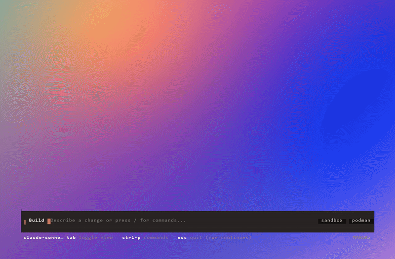
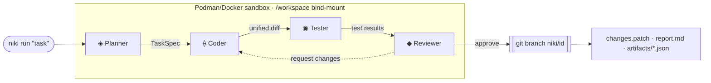

<!--
  NIKI — README
  Logo: GitHub's Markdown sanitizer strips inline <svg>, so the logo is a committed,
  self-contained SVG (assets/logo.svg) referenced via . It carries its own dark
  card, so it renders identically in GitHub's light and dark themes with no external
  hosting and no `prefers-color-scheme`.

  Nothing in the SVG is a font. The four agent glyphs and the wordmark are both
  paths: the glyphs are the four `niki` prints at runtime (◈ ⟠ ◉ ◆), and N, I, K and
  I are all straight lines. An earlier version drew the wordmark with <text> and
  `ui-monospace`, which rendered as a stretched proportional face anywhere that
  font stack was not the first match — the one difference a logo must not have.
-->

<div align="center">


<br>


<br>

**NIKI adds a security review pass automatically when your change touches auth, crypto, or
network code** — and hands you a reviewable `niki/<id>` branch either way.

Four agents — **Planner → Coder → Tester → Reviewer** — run in an isolated sandbox. A risk
classifier decides which of them run: a low-risk edit gets the fast path, anything touching
auth, crypto or network is escalated to a dedicated security audit before the branch is cut.
Committed branches are never rewritten.

**No API key and no container runtime required** — [Ollama](https://ollama.com) plus the
worktree backend runs the real pipeline. **Caveat, measured rather than assumed:** each stage
must emit a schema-conformant JSON artifact, and a small local model often cannot.
`qwen2.5-coder:3b` fails at the Coder stage on ordinary tasks. Run
[`scripts/dogfood.sh`](scripts/dogfood.sh) to see where your model stops — it drives a real
project with a real failing test and reports the stage, the reason, and whether a branch was
produced.

<br>

[](https://www.rust-lang.org/)
[](https://github.com/RavaniRoshan/niki/actions/workflows/ci.yml)
[](#sandbox)
[](#configuration)
[](LICENSE)
[](#roadmap)

<sub>946 unit tests · ~540 integration tests across 53 binaries · 11 canaries that inject real
defects to prove the suite fails when the product is broken · Apache-2.0, no telemetry, your
own keys</sub>

<br>

## Install

```bash
# macOS
brew install niki

# Linux / macOS
curl -fsSL https://raw.githubusercontent.com/RavaniRoshan/niki/master/scripts/install.sh | bash

# Or grab a binary directly
# https://github.com/RavaniRoshan/niki/releases/latest
```

Then open the interface:

```bash
niki ui
```

`niki ui` launches the NIKI terminal interface. It ships as a self-contained executable beside
`niki`, so there is nothing else to install — no Node, no bun.

Then, inside your project:

```bash
niki init --interactive          # guided setup; pick Ollama when offered — no API key needed
niki ui                          # or work on a task interactively from here
niki run "Add a /health endpoint" --backend worktree
```

The interface is also available on its own if you are working on it:

```bash
cd shell && bun install && npm run build:binary   # builds shell/dist/niki-shell
niki ui --shell shell/dist/niki-shell             # or set NIKI_SHELL_BIN
```

If the interface executable cannot be found, `niki ui` says so and names the command to build it,
rather than opening an empty screen.

With a small local model this may stop at a stage: each one must emit a schema-conformant
JSON artifact. `./scripts/dogfood.sh` reproduces the check against a real project.

Full walkthrough in [Quick Start](#quick-start).

<br>


<a href="#quick-start"><b>Quick Start</b></a> ·
<a href="#how-it-works"><b>How it works</b></a> ·
<a href="#why-niki"><b>Why Niki</b></a> ·
<a href="#configuration"><b>Configuration</b></a> ·
<a href="#cli-reference"><b>CLI</b></a> ·
<a href="#roadmap"><b>Roadmap</b></a>

</div>

---

## See it run

<p align="center">
  
</p>

Describe a change in plain English. NIKI runs a four-stage agent pipeline and gives you back a branch to review — nothing lands on `main` until you say so. Stages run inside a container sandbox by default, or in a git worktree with `--backend worktree` when you have no container runtime.

```bash
niki run "Add a GET /health endpoint returning { status: 'ok', uptime }" --project ./my-app
```

```text
 ◈ ⟠ ◉ ◆   NIKI
   "Add a GET /health endpoint…"

 [Planner]   Done — Spec: 1 file to modify
 [Coder]     Done — Changed 1 file · index.js [modified]
 [Tester]    Done — 8/8 tests passed
 [Reviewer]  Done — Approved · correctness 10/10 · quality 8/10 · coverage 10/10
 [NIKI]      Task complete — Branch: niki/6d281d6d · Verdict: Approved · Revisions: 0
```

Every run leaves behind a `niki/<id>` branch, a `changes.patch`, a human-readable `report.md`, and per-agent JSON artifacts — the entire decision trail is inspectable.

### Try it in 30 seconds, with no API key

```bash
git clone https://github.com/RavaniRoshan/niki && cd niki
cargo build --release
./scripts/demo.sh
```

That runs the **real** pipeline — four agents, schema validation, the worktree
sandbox, diff capture, branch creation — against a scripted local model server.
You end with a real `niki/<id>` branch and a diff you can read.

What is real and what is not: the agents, the handoff, the contracts, the review
gate and the branch hand-off are all genuine. The model's *answers* are canned,
because there is no key to spend. It demonstrates the harness, not model
quality. For that, point NIKI at a real provider and run the same command.

Requirements: `git`, `node`, `npm`, `python3`, `curl` on your `PATH`. No
container runtime, no Docker, no API key. The script preflights and tells you
what is missing.

> **Proof, not promises.** Every claim about NIKI is backed by artifacts NIKI itself produces. Each run writes a `report.md` plus per-agent JSON artifacts (`artifacts/*.json`) capturing exactly what every agent decided and why — the entire decision trail is inspectable and reproducible. See the `docs/launch-audit.md` for the methodology and honest findings behind NIKI's design.

## Why Niki

> **Stop babysitting your AI. Let agents debate so you don't have to.**

Today's AI coding tools — Cursor, Devin — run on a **single agent** in one long conversation, which brings three recurring failures:

- **Confirmation bias** — one agent never truly challenges its own assumptions.
- **Context drift** — output quality degrades as the conversation grows.
- **The babysitting tax** — you must constantly steer, correct, and re-verify its work.

Niki takes a different path. Work is split across **independent agents that can't influence one another** — isolated at the **context** layer (they share no history; they exchange only typed artifacts) and executed inside a Podman or Docker sandbox. Sequential stages intentionally share one execution sandbox so the diff persists from Coder → Tester → Reviewer; independence is at the LLM-session layer, not per-stage containers. Independence is the whole point: it's what removes the bias a single agent can't escape. You describe the task, the agents debate their way to a result, and you review a finished branch.

**Who it's for** — solo developers, indie hackers, and small teams (2–5) who already use AI coding tools but are tired of the prompt-response loop, and want to delegate complex, multi-file tasks and review a polished result instead.

|   |   |
|---|---|
| 🧩 **Multi-agent, not monolithic** | Planning, coding, testing, and review are separate agents with their own prompts and models — each does one job well, instead of one model doing everything at once. |
| 🔒 **Hermetic by default** | All work happens in a Podman or Docker sandbox bind-mounted to your project (Docker writes through the mount; worktree applies the diff back). Committed branches are never repointed and history is never rewritten; the working tree receives the finished diff for review. |
| 🌿 **Output is a git branch** | You get `niki/<id>` with a real commit, a diff, and artifacts — reviewable like any human PR. No opaque auto-commits to `main`. |
| 🔑 **BYOK & provider-mixing** | Bring your own keys. Give each agent a different provider/model — a strong reasoner for Planner/Reviewer, a cheap model for Tester. |
| 🔁 **Reviewer-driven revisions** | The Reviewer can bounce work back to the Coder for up to `max_revision_rounds` before completion. |
| 📓 **Fully auditable** | `report.md`, `changes.patch`, and `artifacts/*.json` capture what every agent decided, and why. |

## How it works


```mermaid
flowchart LR
    U(["niki run &quot;task&quot;"]) --> P

    subgraph Sandbox["Podman/Docker sandbox · /workspace bind-mount"]
        direction LR
        P["◈ Planner"] -->|TaskSpec| C["⟠ Coder"]
        C -->|unified diff| T["◉ Tester"]
        T -->|test results| R["◆ Reviewer"]
        R -.->|request changes| C
    end

    R -->|approve| G[["git branch niki/id"]]
    G --> A["changes.patch · report.md · artifacts/*.json"]
```

1. **Planner** reads the task plus current file contents and produces a `TaskSpec` — which files to touch, and the approach.
2. **Coder** emits a unified diff, applied to the bind-mounted workspace inside the sandbox.
3. **Tester** generates and runs tests against the change.
4. **Reviewer** issues a verdict; on *request-changes* it loops back to the Coder until approved or `max_revision_rounds` is reached.
5. NIKI captures the working-tree diff, commits it to a fresh `niki/<id>` branch, and writes the artifacts.

## Quick Start

**Path A · Zero-setup (try it in ~2 minutes):** no container runtime, no API key.
All you need is [Ollama](https://ollama.com) running locally with a coding model
(`ollama pull qwen2.5-coder:3b`) — the wizard detects both and points every agent at them.

```bash
# 1 · Create and enter your project
mkdir my-app && cd my-app && git init

# 2 · Configure (guided — run it inside your project; pick Ollama when offered)
niki init --interactive

# 3 · Run your first task: worktree backend needs no container, Ollama needs no key
niki run "Add a /health endpoint" --backend worktree

# 4 · Review the result
niki report <id>    # full report, or a unique short prefix
```

**Path B · Full sandbox (hermetic containers + hosted models):** for real work
with API providers, add a container runtime and a key.

```bash
# 1 · Prerequisites
# [Rust](https://www.rust-lang.org/tools/install) (1.88+) ·
# [Podman](https://podman.io/getting-started/installation) (recommended) or
# [Docker](https://docs.docker.com/get-docker/) · an API key for one LLM provider.

# 2 · Build the sandbox image
podman build -t niki-sandbox:24.04 -f docker/Dockerfile .   # or: docker build ...

# 3 · Configure (guided)
niki init --scan          # writes niki.toml + drafts AGENTS.md from your project
export ANTHROPIC_API_KEY=sk-ant-...   # or OPENAI_API_KEY / GOOGLE_API_KEY / OPENROUTER_API_KEY

# 4 · Plan first (recommended), then execute
niki plan "Add a /health endpoint" --project /path/to/your/project
niki run --plan <id> --project /path/to/your/project   # or run directly:

# 4alt · Run your first task directly
niki run "Add a /health endpoint" --project /path/to/your/project

# 5 · Review the result
niki report <id>    # full report, or a unique short prefix
```

**First verified branch in under five minutes** once prerequisites are in place —
about two of those on Path A (install + `ollama pull qwen2.5-coder`), since there
is no image to build and no key to provision.

> **What does a task cost?** NIKI is free software; you pay only your provider
> (or nothing — local Ollama runs are **$0.00**). Measured on a real small task
> (~2.9k input / ~0.25k output tokens across the pipeline, priced at NIKI's own
> meter rates): **~$0.01 on Claude Sonnet 4, <$0.005 on Haiku or GPT-4o-mini**.
> Every run reports exact tokens and cost, `general.spend_cap_usd` aborts past
> your ceiling, and unpriced models warn instead of silently costing $0.00.

### Verify your setup

```bash
niki doctor               # check install, config, providers, sandbox, security
niki smoke                # run a trivial task to verify end-to-end
niki smoke --backend worktree   # same, with no container runtime
```

## Configuration

Niki reads `niki.toml` from the project root. Keys can also come from environment variables (`ANTHROPIC_API_KEY`, `OPENAI_API_KEY`, `GOOGLE_API_KEY`) — **env vars take precedence, so secrets never have to be committed.**

Provider `base_url` and `model` likewise follow standard conventions and can be set from the environment, overriding `niki.toml`: `ANTHROPIC_BASE_URL` / `ANTHROPIC_MODEL` and `OPENAI_BASE_URL` / `OPENAI_MODEL`.

```toml
[general]
max_revision_rounds = 3
spend_cap_usd = 5.0          # NIKI aborts if est. cost exceeds this

# Per-agent model assignment — mix providers freely
[agents.planner]
provider = "anthropic"
model    = "claude-sonnet-4-20250514"

[agents.coder]
provider = "anthropic"
model    = "claude-sonnet-4-20250514"

[agents.tester]
provider = "openai"
model    = "gpt-4o-mini"     # cheaper model for test generation

[agents.reviewer]
provider = "anthropic"
model    = "claude-sonnet-4-20250514"
```

Supported providers: **Anthropic · OpenAI · Google · Ollama · OpenRouter · OpenCode Zen · Kimi Code · KiloCode · NVIDIA · Groq · Together · DeepSeek** — plus any OpenAI/Anthropic-compatible gateway via `base_url`.

### Advanced

| Feature | Config | Docs |
|---|---|---|
| Custom pipeline topology | `[pipeline]` | `docs/content/06-configuration/` |
| Parallel coders + synthesis | `[parallel]` | `docs/content/02-agent-pipeline/06-specialized-agents.mdx` |
| External source ingestion | `[knowledge]` | `docs/content/06-configuration/` |
| Security audit pass | `[security]` | `docs/content/03-sandboxing-security/` |
| Adversarial Red review | `[red_blue]` | `docs/content/02-agent-pipeline/06-specialized-agents.mdx` |
| MCP server integration — a configured server's read-only tools are callable by the agent loop as `mcp__<server>__<tool>` | `[mcp]` | `docs/content/06-configuration/` |
| Permissions model | `[permissions]` | `docs/content/03-sandboxing-security/` |

### Sandbox backends

Niki defaults to Podman (rootless, no daemon) with a Docker fallback. A git-worktree backend is also available (no container runtime required):

```bash
niki run "..." --backend worktree   # no container runtime
```

### Security & privacy

- **No telemetry.** Only outbound traffic is your LLM API calls (or local Ollama).
- **Sandboxed by default.** Rootless container with CapDrop ALL, network disabled, optional read-only rootfs (`[docker] readonly_rootfs`, off by default; the bind-mounted workspace stays writable).
- **Your keys, never bundled.** BYOK only; keys redacted from provider error text, which is what reaches logs and reports. `niki doctor --category security` measures this against 13 known key shapes.
- **Spend cap enforced.** Aborts before branch creation if cost exceeds limit.
- **Audit trail.** Per-agent artifacts, metrics, `safety_proof.json`, `trace.jsonl`, and `niki audit` bundles for every run.
- **Permission posture.** Modes (`manual/auto/dontask/bypass`), project trust, worktree kill-switch, fail-closed headless option.
- **Observable.** `--output-format json` contract plus OTLP trace export.

## CLI Reference

| Command | Description |
|---|---|
| `niki run <description>` | Run the pipeline. Flags: `--project`, `--branch`, `--max-rounds`, `--backend`, `--tui`, `--dry-run`, `--plan <id>`, `--force`, `--bare`, `--output-format text\|json`, `--permission-mode`, `--otel-endpoint`, per-agent `--*-model`. |
| `niki plan <description>` | Plan mode: research without executing; writes reviewable `plan.md`. Approve with `niki run --plan <id>`. |
| `niki session` | `list/show/checkpoints/undo/rewind [--mode both\|code\|conversation]` chat & pipeline sessions. |
| `niki resume <id>` | Resume an interrupted agent session from a checkpoint. |
| `niki commands` | `list/show/expand` user slash commands (`.niki/commands/*.md` + `[commands] extra_dirs`). |
| `niki audit [id]` | Consolidated JSON compliance bundle for one task (record, proofs, costs, trace). |
| `niki init [--scan]` | Initialize `niki.toml` (alias for `config init`); `--scan` drafts `AGENTS.md` from the project index. |
| `niki status` | Current/most recent task status (`[task-id]`, `--with-provenance` for the run manifest). |
| `niki inspect [--json]` | Repository structure: languages, entry points, tests, risk signals. |
| `niki architecture build` | Build the project knowledge base (`.niki/kb/`). Deterministic, no LLM. |
| `niki index build\|query` | Content-addressed structural symbol index (`build [--full\|--dry-stats]`, `query <sym> [--callers\|--callees]`). Advisory only. |
| `niki report [id]` | Print a task's report (UUID or short prefix). |
| `niki doctor` | Diagnostics: install, config, providers, sandbox, image presence, security. |
| `niki smoke` | Quick pipeline verification. |
| `niki chat` | **The default surface.** A bare `niki` on a terminal opens this. Type a message to talk to the model; `/run <task>` starts the four agents and hands back a branch. |
| `niki skills` | List, show and manage the skills available to agents. |
| `niki config` | Manage configuration (`init`, `schema`, `check`). |
| `niki recommend` | Per-agent model recommendations + observed spend from past runs. |
| `niki dashboard [id]` | Static HTML diff viewer. |
| `niki eval [grade]` | Seeded-defect harness (replay/live) with cost accounting, disclosure manifest, maintainer grading. |
| `niki auth` | Manage API credentials. |
| `niki providers` | Check LLM provider configurations, and list the models an account can actually run (`providers models`). |
| `niki memory` | View agent memory. |
| `niki goal` | Manage persistent goals. |
| `niki research <query>` | Web research with cited summary. |
| `niki voice` | Record and transcribe a voice message. |
| `niki verify` | Screenshot-based visual verification. |
| `niki acp` | Agent Client Protocol server (drives Zed/Claude Code IDE clients). |
| `niki serve` | The engine as a `niki-protocol` JSON-RPC server over stdio: one JSON object per line, protocol frames on stdout, diagnostics on stderr. |

Run `niki <command> --help` for full flags.

## Project Structure

```text
src/
├── agents/        # Planner, Coder, Tester, Reviewer (+ Red, Critic, SecurityAuditor, Synthesizer)
├── orchestrator/  # pipeline sequencing + task state + provenance + reflection
├── repo_intel/    # deterministic repository manifest (`niki inspect`)
├── risk/          # risk-tier classifier gating pipeline topology
├── knowledge/     # KB store, history miner, structural index, context pack
├── sandbox/       # Sandbox trait: Podman/Docker / git-worktree backends
├── llm/           # provider clients (anthropic, openai, google, ollama)
├── runtime/       # tool registry + 22 baseline tools
├── mission/       # mission/session/agent stores
├── activity/      # agent state grammar (12 states)
├── event/         # event bus (typed domain events)
├── persistence/   # mission-scoped JSON storage
├── output/        # git branch/commit, patch, report generation
├── artifacts/     # typed artifacts + JSON-schema validation
├── config/        # niki.toml loading & env overrides
├── display/       # streaming TUI + non-TTY log fallback
├── memory/        # hierarchical memory store & compression
├── session/       # interactive session tracking & rewind
├── goal/          # multi-iteration autonomous goal loop
├── mcp/           # Model Context Protocol client & gateway
├── skills/        # skill registry, discovery & promotion
├── store/         # converged storage engine (hybrid vector + FTS)
├── permissions/   # command and tool execution policy
├── audit/         # lifecycle hook execution & audit logging
├── eval/          # evaluation runner & scoring harness
└── cli/           # run / status / report / config / goal / memory / skills
prompts/           # externalized agent prompts (*.md)
docker/            # sandbox image (Dockerfile)
```

## What Niki is NOT

- **Not a replacement for your judgment.** You review the diff and `report.md` before merging.
- **Not a single all-knowing agent.** Four independent agents, each with narrower context windows.
- **Not training on your code.** BYOK, no telemetry, no hosted service.
- **Not magic on huge codebases.** Works best on tasks with a clear spec and testable outcome.

## Roadmap

### Shipped
- [x] Cost & performance analytics
- [x] User-defined pipeline topologies
- [x] Parallel coders + synthesis
- [x] Security Auditor agent
- [x] External source ingestion
- [x] Rich terminal TUI
- [x] Dashboard (diff viewer)
- [x] Git worktree backend
- [x] Per-agent model recommendations
- [x] Plan mode (`niki plan` → review → `niki run --plan`)
- [x] Honest cost metering + spend-cap enforcement + OTLP trace export
- [x] Headless CI contract (`--bare`, `--output-format json`, pipe-pure stdout)
- [x] Permissions model + lifecycle hooks + fail-closed headless
- [x] 12 providers incl. local-first Ollama + single-key gateways (OpenRouter, Zen, Kimi, Kilo)

### Later
- [ ] Cloud execution (beta)
- [ ] Living memory · pipeline marketplace
- [ ] Architect agent · Enterprise tier

See [`docs/distribution-plan.md`](docs/distribution-plan.md) for the full plan.

## Contributing

Issues and PRs are welcome. Please keep `cargo build` warning-free and keep secrets out of commits — `niki.toml` and the `.niki/` artifact directory are git-ignored by default.

See [`CONTRIBUTING.md`](CONTRIBUTING.md) for the workflow.

## License

Niki is **free and open source**, licensed under the **Apache License 2.0** — see [`LICENSE`](LICENSE).

- Use, modify, redistribute in production (including with your own API keys).
- Contributions welcome under the same license.

---

<div align="center">
<sub>The name <b>NIKI</b> carries personal meaning to its founder. · Built in Rust 🦀 · Runs anywhere Podman or Docker does 🐳</sub>
</div>
