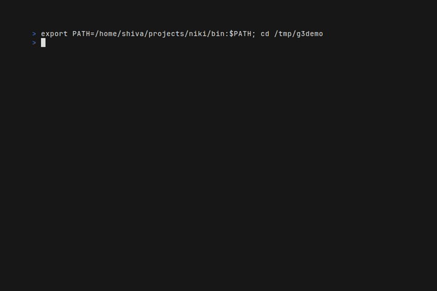

<div align="center">

# NikiCode

**NikiCode is an agentic coding tool that lives in your terminal, understands your codebase, and helps you code faster by executing routine tasks, explaining complex code, and handling git workflows — all through natural language commands.**
<!-- claims: C1 C2 C3 C4 C5 C6 -->
> Speed: scoped startup and weight deltas against Codex are measured in the table below. A blanket comparison ships only with the reproducible G4 benchmark table.
<!-- claims: C7 C8 C9 -->

> Rename in progress (G1): `niki` → `nikicode`. This README is updated
> slice by slice; the full rewrite with benchmark evidence lands in G6.

[](go.mod)
[](https://github.com/RavaniRoshan/niki/releases)
[](LICENSE)
[](#-performance-contracts-no-feelings-just-measurements)
[](#-performance-contracts-no-feelings-just-measurements)
[](#-architecture--principles)

<br/>

```bash
# Install instantly with Go
go install github.com/RavaniRoshan/niki/cmd/nikicode@latest

# Or download the pre-compiled binary from GitHub Releases
curl -sSL https://raw.githubusercontent.com/RavaniRoshan/niki/main/install.sh | bash
```

[Quick Start](#-quick-start) • [Installation](#-installation-guide) • [Performance](#-performance-contracts-no-feelings-just-measurements) • [Security & Sandbox](#-security--sandbox-by-default) • [Architecture](#-architecture--principles) • [Documentation](docs/)

</div>

<p align="center">
  
</p>
<p align="center"><sub>Real footage of the actual binary (mock provider) — reproducible from <a href="docs/demo.tape">docs/demo.tape</a>.</sub></p>

---

## 📊 Performance Contracts: No Feelings, Just Measurements

Measured on host (`AMD Ryzen 7 4800H`, `Linux WSL2`, `go1.27.1`) using the included PTY probe harness (`tools/ttff`) and `hyperfine 1.20.0`. Every number is real and stored in [`docs/PERF.md`](docs/PERF.md) and [`perf/budgets.toml`](perf/budgets.toml):
<!-- claims: C7 C8 C9 -->

| Tool / Agent | `--version` | TTFP (First Paint) | Input Ready | Idle Memory (2s) | Pre-Prompt Bytes | Binary Size |
| :--- | ---:| ---:| ---:| ---:| ---:| ---:|
| **Codex CLI** (`0.152.1`, Rust) | 20.2 ms | 17.6 ms | 170.7 ms* | 69.3 MB | 88 B | 244 MB |
| **Google agy** (`1.3.1`, Go) | 19.3 ms | 778.5 ms | 778.5 ms | 225.5 MB | 7 B | 202 MB |
| **Kimi Code** (`2.1.1`, TS/Node) | 188.4 ms | 1253.7 ms | 1253.7 ms | 391.6 MB | 7 B | 75 MB |
| **NikiCode** (`0.11.0`, Go) | **6.2 ms** | **5.4 ms** | **16.9 ms** | **16.1 MB** | **12 B** | **19.7 MB** |
| *Contract Budget* | *≤ 20.0 ms* | *≤ 23.4 ms* | *≤ 23.4 ms* | *≤ 40.0 MB* | *minimized* | *< 25 MB* |

> Medians, N=30, same machine (`nikicode bench`, raw in `docs/bench/raw/`). *Codex paints its header at 170.7ms but sits behind an update modal that blocks input; NikiCode RSS is 9.1MB with a real home (16.1MB fresh-home).

> **Startup**: NikiCode prints `--version` **3.3x faster** than Codex, paints first bytes **3.3x faster** (content paint **10x faster**), uses **77% less idle RSS**, and ships a binary **12x smaller**. Full table with method and caveats: [`docs/BENCH.md`](docs/BENCH.md).

---


## 🚀 Quick Start

### 1. Set Your Model API Key
```bash
export ANTHROPIC_API_KEY="sk-ant-..."
# or
export OPENAI_API_KEY="sk-..."
```

### 2. Scaffold Your Project
Initialize your workspace with an `AGENTS.md` instructions hierarchy:
```bash
nikicode init
```

### 3. Verify Health & Environment
Run the built-in doctor command to check sandbox capabilities, provider credentials, and terminal state:
```bash
nikicode doctor
```

### 4. Start Pair Programming
```bash
# Launch the interactive TUI
nikicode

# Or run non-interactive headless tasks
nikicode exec "Audit the repo for open ports and write a summary to ports.md"
```

---

## Why NikiCode?

Most modern coding agents are hundreds of megabytes of Node, Electron, or heavy runtimes that take seconds to boot, consume hundreds of megabytes of RAM just sitting idle, and execute unchecked commands directly on your workstation.

**NikiCode is different.** It was built from the ground up for developers who demand complete ownership, uncompromising speed, and verifiable safety:

* 🚀 **Instant Boot**: Boots to an interactive frame in **17 ms warm** and outputs `--version` in **6.2 ms** (3.3x faster than Codex, same machine, N=30).
<!-- claims: C7 C8 -->
* 🪶 **Featherweight**: Consumes just **9.1 MB** of idle RSS in a single **19.2 MB** static binary with zero runtime dependencies.
<!-- claims: C9 -->
* 🛡️ **Safe by Default**: Sandboxed execution through unprivileged **Bubblewrap** (`bwrap`) with a read-only root, private `/tmp`, network namespace denial, dropped capabilities, and an approval prompt that defaults to **Deny**.
<!-- claims: C17 -->
* 🖥️ **Inline Terminal UI**: Custom Bubble Tea inline viewport that commits finalized turns directly to your native terminal scrollback with `tea.Println`—no virtual scroll stutter, no UI thrashing.
<!-- claims: C17 -->
* 🔌 **Unblocked Extensibility**: Background parallel Model Context Protocol (MCP) startup, mtime-cached skills discovery (148x speedup), and `.agents/skills` compatibility.
<!-- claims: C17 -->
* 🧠 **Multi-Provider Engine**: Native streaming support for Anthropic Claude (`/messages`), OpenAI Responses API (`/v1/responses`), ChatCompletions, and local models (Ollama, vLLM) with automatic exponential backoff on 429/5xx and truncated stream recovery.
<!-- claims: C17 -->
* 💾 **Crash Resilience**: Atomic JSONL rollouts allow instant recovery from abrupt mid-turn termination (`kill -9`) with zero lost context.
<!-- claims: C17 -->

---

## 📦 Installation Guide

### System Requirements
* **Operating Systems**: Linux (x86_64, arm64), macOS (Apple Silicon & Intel), Windows (x86_64).
* **Sandboxing (Linux)**: Bubblewrap (`bwrap`) is recommended for container-grade unprivileged command isolation.
  ```bash
  # Debian/Ubuntu
  sudo apt-get install bubblewrap

  # Fedora / RHEL
  sudo dnf install bubblewrap

  # Arch Linux
  sudo pacman -S bubblewrap
  ```

---

### Option 1: Pre-built Binaries (GitHub Releases)

Download pre-compiled static binaries directly from the [Releases](https://github.com/RavaniRoshan/niki/releases) page:

```bash
# Linux (amd64)
curl -L https://github.com/RavaniRoshan/niki/releases/latest/download/nikicode_linux_amd64.tar.gz | tar -xz
sudo mv nikicode /usr/local/bin/nikicode
sudo ln -sf nikicode /usr/local/bin/nc
sudo ln -sf nikicode /usr/local/bin/niki

# macOS (Apple Silicon arm64)
curl -L https://github.com/RavaniRoshan/niki/releases/latest/download/nikicode_darwin_arm64.tar.gz | tar -xz
sudo mv nikicode /usr/local/bin/nikicode
sudo ln -sf nikicode /usr/local/bin/nc
sudo ln -sf nikicode /usr/local/bin/niki

# macOS (Intel amd64)
curl -L https://github.com/RavaniRoshan/niki/releases/latest/download/nikicode_darwin_amd64.tar.gz | tar -xz
sudo mv nikicode /usr/local/bin/nikicode
sudo ln -sf nikicode /usr/local/bin/nc
sudo ln -sf nikicode /usr/local/bin/niki
```

---

### Option 2: Go Install
If you have Go 1.24+ installed on your system:
```bash
go install github.com/RavaniRoshan/niki/cmd/nikicode@latest
```
Ensure your `$GOPATH/bin` or `$HOME/go/bin` is in your `$PATH`.

---

### Option 3: Build from Source
Build a static, stripped binary in under 5 seconds:
```bash
git clone https://github.com/RavaniRoshan/niki.git
cd niki
go build -ldflags="-s -w" -o bin/nikicode ./cmd/nikicode
make install  # installs nikicode + nc + niki (compat) to ~/.local/bin
```

---

## 🔒 Security & Sandbox by Default

A coding model with arbitrary shell access is an inherent risk. NikiCode implements defense-in-depth from day one:

```
[Untrusted Tool Request]
          │
          ▼
┌───────────────────────────────────────────────┐
│         Permission Approval Guard             │
│  - Safest option (DENY) focused by default    │
│  - Esc key immediately aborts execution       │
│  - Untrusted project configs blocked          │
│  - All decisions logged to audit trail        │
└──────────────────────┬────────────────────────┘
                       │ Approved
                       ▼
┌───────────────────────────────────────────────┐
│     Bubblewrap Sandbox (`nikicode sandbox-run`)   │
│  - Read-only root filesystem (`/`)            │
│  - Isolated private in-memory `/tmp`          │
│  - Network namespace dropped (`--unshare-net`)│
│  - Linux capabilities stripped (`--cap-drop`) │
│  - Bounded strictly to writable workspace     │
└───────────────────────────────────────────────┘
```

* **Default Deny**: Interactive permission requests always focus **Deny** by default. Hitting `Esc` cancels immediately.
* **Red-Team Verified**: Proven resistance against exfiltration traps (`README.md` curl payloads), symlink directory traversal escapes, and hostile package lifecycle scripts. Tested in [`internal/permissions/redteam_test.go`](internal/permissions/redteam_test.go).
* **Project Trust Boundary**: Untrusted repositories cannot start MCP servers or execute hooks from a project `nikicode.toml` unless the project path is listed in `~/.nikicode/trusted_projects`.

Read more in [`docs/SECURITY.md`](docs/SECURITY.md).

---

## 🛠️ Built-In Tool Suite

NikiCode ships with an uncompromised, zero-fluff set of core coding tools:

| Tool | Purpose | Safety Guarantees |
| :--- | :--- | :--- |
| `read_file` | Read file contents with line ranges | Bounded size limits, path sanitization |
| `write_file` | Atomic write file replacement | Temporary file swap, prevents corruption |
| `edit_file` | Targeted string replacement | Requires exact match, rejects ambiguous edits |
| `apply_patch` | Unified diff patch applicator | Fuzzed parser (>400k iterations with 0 panics) |
| `glob` | Find files matching wildcard patterns | Bounded directory walking, ignore awareness |
| `grep` | Fast regex content search | Read-only concurrency, skip binary files |
| `shell` | Execute shell commands in workspace | Bubblewrap isolation, network denial, dropped caps |

---

## ⌨️ Slash Commands & Terminal Controls

Within the interactive TUI, control NikiCode effortlessly:

| Slash Command | Action |
| :--- | :--- |
| `/help` | Display active keybindings, tools, and slash commands |
| `/doctor` | Run comprehensive system and sandbox diagnostics |
| `/compact` | Force context compaction, folding past turn history |
| `/model` | Inspect active model, context window, and token prices |
| `/clear` | Clear visible terminal viewport |
| `/quit` | Cleanly restore terminal termios state and exit |

### Keyboard Shortcuts
* `Enter` — Send message or execute command.
* `Esc` — Interrupt ongoing model stream or deny approval prompt.
* `Ctrl+C` — Cleanly cancel current turn and restore terminal state.
* `Ctrl+Z` — Suspend process to background.

---

## ⚙️ Configuration & Profiles

NikiCode merges layers (later wins): `Defaults` → global `~/.config/nikicode/nikicode.toml` → profile (API) → project `nikicode.toml` → `--config` file → environment → CLI flags. Legacy `niki` spellings are honored; see `CONFIG.md`.

Inspect your effective configuration and see exactly where each setting originates:
```bash
nikicode config show --sources
```

Example configuration (global `~/.config/nikicode/nikicode.toml`):
```toml
# Model settings
model = "claude-3-5-sonnet"
provider = "anthropic"            # "anthropic", "responses", "openai"

# Performance
disable_preconnect = false        # Set true (or NIKICODE_NO_PRECONNECT=1) to skip the background DNS warm

# Sandbox & Safety
sandbox_backend = "bubblewrap"
deny_network = true
writable_roots = ["."]
trusted_projects = ["/home/user/projects/trusted"]

# Profiles (loadable via API; no --profile selector yet)
[profiles.fast]
model = "gpt-4o-mini"
provider = "openai"

[profiles.deep]
model = "claude-3-7-sonnet"
provider = "anthropic"

# Model Context Protocol (MCP)
[mcp.filesystem]
command = "npx"
args = ["-y", "@modelcontextprotocol/server-filesystem", "."]
required = false
startup_timeout_sec = 10
tool_timeout_sec = 30
```

Read the full configuration guide in [`CONFIG.md`](CONFIG.md).

---

## 📖 Deep-Dive Documentation

* 📐 [Architecture & Dependency Graph](docs/ARCHITECTURE.md) — Package DAG, acyclic invariants, and design principles.
* ⚙️ [Configuration](CONFIG.md) — Layers, profiles, project trust, environment.
* 🛠️ Routines: [`nikicode do`](docs/CLAIMS.md) (recipes in `internal/recipes/*.md`), [git workflows](docs/CLAIMS.md) (`nikicode git`), [code explanations](docs/CLAIMS.md) (`/explain`, `nikicode do "explain …"`).
* 🤖 Subagents, plan mode, memory, MCP, and providers: [capability parity](docs/PARITY.md), [feature atlas](docs/FEATURE_ATLAS.md).
* ⚡ [Performance Ledger](docs/PERF.md) — Inittrace audit, pprof analysis, runtime traces, and PGO benchstat data.
* 🏁 [Benchmark Method & Table](docs/BENCH.md) — `nikicode bench` protocol, raw logs, per-metric verdicts.
* 🛡️ [Security Posture](docs/SECURITY.md) — Bubblewrap sandbox model, trust boundaries, and red-team defenses.
* 📜 [Third-Party & Attributions](THIRD_PARTY.md) — Dependency licenses, attributions, and clean-room provenance statement.
* 🐶 [Dogfooding Journal](docs/DOGFOOD.md) — Real self-hosting sessions, bugs caught, and ergonomic friction logs.
* ✅ [Claims Ledger](docs/CLAIMS.md) — Every user-facing claim with its proving probe.
* 🏁 [Final Verdict](docs/VERDICT.md) — Positioning trace, speed verdict, what was not built.

---

## 📦 Packaging (out of scope, unbuilt)

NikiCode is personal tooling, not a product. There is deliberately no
distribution: no Homebrew formula, no website, no launch, no auto-update,
no signing/notarization pipeline, and no release-channel QA. The
`.goreleaser.yaml`, `install.sh` release-download path, and `release.yml`
workflow exist from earlier scaffolding and are **dormant and unbuilt**:
cutting a release would additionally need version stamping, checksums,
signed artifacts, install-path conventions (`nc`/`niki` aliases), and a
migration notice — none of that is done. Personal install is
`make install` (local build + symlinks into `~/.local/bin`).

---

## 🤝 Philosophy & Clean-Room Commitment

NikiCode is dedicated to personal autonomy, performance, and transparency:
1. **Rule of Proof**: "Works" means a real test or measurement ran and its output was verified.
2. **Zero Proprietary Code**: No leaked, decompiled, or reconstructed proprietary source was ever accessed or copied.
3. **Small and Boring**: Dependencies pass strict admission checks. Zero framework sprawl.

---

## 📄 License

Licensed under the [MIT License](LICENSE).
Copyright (c) 2026 Roshan Ravani.
