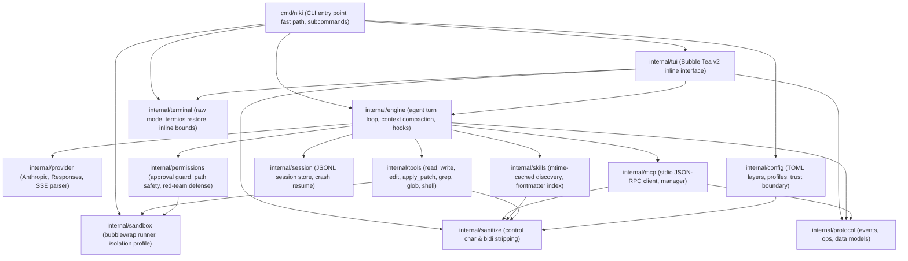

# NIKI Architecture & Dependency Graph

NIKI is built as a single, static Go binary designed for ultra-fast startup, complete user ownership, and strict safety boundaries.

## 1. Principles & Design Constraints

1. **One language, one binary**: Zero CGO dependencies, single static executable (`go build -o bin/niki cmd/niki/main.go`).
2. **Headless core first**: All user-facing interfaces (Bubble Tea TUI, headless `exec`, or test drivers) are clients consuming the same `protocol.EngineEvent` stream.
3. **Boot critical path**: The interactive startup path contains ONLY argv parsing, minimal config loading, terminal initialization, and rendering the first frame. Heavy tasks (MCP servers, skills discovery, model preconnect) run strictly in the background.
4. **Safety by default**: Command execution runs through the sandbox isolation layer (`niki sandbox-run` via Bubblewrap) with read-only root, private `/tmp`, network namespace denial, dropped Linux capabilities, and explicit approval prompts for modifying commands.

---

## 2. Package Dependency DAG

Dependency flow is strictly acyclic. Lower-level packages never import higher-level packages.

---

## 3. Package Responsibilities

| Package | Purpose | Invariants |
| :--- | :--- | :--- |
| `cmd/niki` | CLI entry point, argv fast-path router, subcommands (`exec`, `doctor`, `init`, `sandbox-run`, `config`). | `--version` must execute before Cobra/heavy packages are touched (<10ms). |
| `internal/protocol` | Core event types (`EngineEvent`, `Op`, `Delta`, `EventKind`). | Leaf package with zero non-standard dependencies. |
| `internal/sanitize` | Terminal rendering defense: strips ANSI escapes, bidi overrides, and dangerous controls. | Used on all untrusted text (MCP output, model output, skill metadata). |
| `internal/terminal` | Terminal capabilities, raw mode management, termios restoration, inline split layout. | Restores terminal state on normal exit, SIGINT, SIGTERM, and unexpected panic. |
| `internal/sandbox` | Sandbox execution backend using Bubblewrap (`bwrap`) with read-only root, private `/tmp`, and network denial. | Re-exec helper `niki sandbox-run` enforces bounded filesystem and dropped capabilities. |
| `internal/permissions` | Dangerous command classification, path traversal defenses, user approval guard, audit logging. | Safest option (`OptionDeny`) is focused by default; `Esc` denies; all decisions logged. |
| `internal/tools` | Built-in tool implementations (`read_file`, `write_file`, `edit_file`, `apply_patch`, `glob`, `grep`, `shell`). | Concurrency safety gates, argument schema validation, path bounding. |
| `internal/skills` | Skills discovery with mtime-cached index and `.agents/skills` compatibility support. | Cold parse caches metadata; warm loads only read directory mtimes. |
| `internal/mcp` | Stdio JSON-RPC client, MCP manager, parallel background server boot, namespaced tools. | Required servers boot eager; optional servers boot lazy; crashed servers cool down with backoff. |
| `internal/provider` | Streaming model providers (Anthropic Messages API, OpenAI Responses API, Chat Completions), custom SSE parser. | Exponential backoff on 429 and 5xx; clear errors on exhausted retries and truncated streams. |
| `internal/session` | Append-only JSONL session recording and crash recovery. | Turn atomic logging; resuming from mid-turn crash (`kill -9`) recovers context cleanly. |
| `internal/engine` | Turn execution loop, context assembly, AGENTS.md chaining, automated compaction, blocking hooks. | Compaction triggers near context limit; hooks can inspect or block tool execution. |
| `internal/config` | 6-layer configuration loading (defaults, global, project, profile, env, CLI flags). | Untrusted repositories cannot register MCP servers or commands from local config. |
| `internal/tui` | Inline Bubble Tea v2 interface, unified slash command registry, live activity and mascot indicators. | Settled cells committed to native scrollback with `tea.Println`; composer never cleared unexpectedly. |
