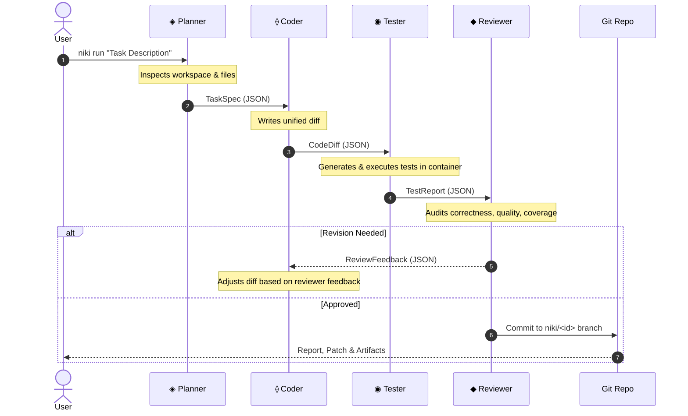

# Multi-Agent Pipeline Overview

At the heart of NIKI is an autonomous pipeline where each stage is handled by a specialized LLM agent.

---

## Artifact Contract

Agents never exchange unstructured conversation logs. Every stage takes a validated JSON input and produces a validated JSON output:

| Producer | Consumer | Artifact | Schema / Purpose |
|---|---|---|---|
| **Planner** | Coder | `TaskSpec` | Problem summary, files to touch, approach, acceptance criteria, constraints |
| **Coder** | Tester, Sandbox | `CodeDiff` | Search/replace hunk edits, rationale, spec adherence verification |
| **Tester** | Reviewer | `TestReport` | Synthesized tests, test execution results, pass/fail status, coverage summary |
| **Reviewer** | Orchestrator, Coder | `ReviewVerdict` | Approved / RevisionNeeded / Rejected, quality scores, granular feedback |

---

## Topology Modes

In `niki.toml`, you can configure how tasks route through the pipeline:

* **`Auto` (Default):** Evaluates task complexity during the planning stage. Low-complexity, single-line or documentation fixes take a fast-path single-agent route, while multi-file or architectural changes run the full 4-agent pipeline.
* **`MultiAgent`:** Strictly forces all tasks through the full Planner → Coder → Tester → Reviewer sequence.
* **`SingleAgent`:** Runs Coder solo without formal Tester/Reviewer revision loops.
