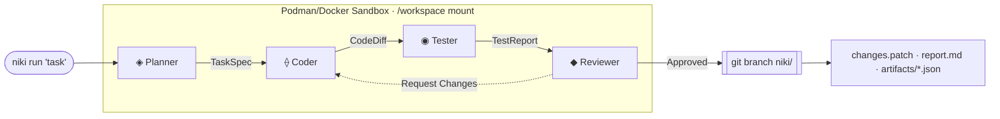

# NIKI

**Turn a sentence into a verified pull request.**

NIKI is an open-source, hermetic multi-agent coding engine written in Rust. Four specialized LLM agents — **Planner → Coder → Tester → Reviewer** — collaborate inside a rootless Podman or Docker container to produce a verified git branch (`niki/<id>`), a unified diff, and a full audit trail.

<Callout type="tip">
  **Your working tree is never touched mid-run.** NIKI clones your workspace into an isolated container sandbox, debates the implementation, executes real test suites, and hands you a clean branch ready for human review.
</Callout>

```bash
niki run "Add a GET /health endpoint returning { status: 'ok', uptime }" --project ./my-app
```

```text
 ◈ ⟠ ◉ ◆   NIKI
   "Add a GET /health endpoint…"

 [Planner]   Done — Spec: 1 file to modify
 [Coder]     Done — Changed 1 file · src/api.rs [modified]
 [Tester]    Done — 8/8 tests passed
 [Reviewer]  Done — Approved · correctness 10/10 · quality 9/10 · coverage 10/10
 [NIKI]      Task complete — Branch: niki/6d281d6d · Verdict: Approved · Revisions: 0
```

---

## Key Capabilities

<CardGroup cols={2}>
  <Card title="Multi-Agent Pipeline" icon="bot">
    Separation of concerns across dedicated agents. Planner maps the scope, Coder writes diffs, Tester validates behavior, and Reviewer audits quality.
  </Card>
  <Card title="Hermetic Sandboxing" icon="shield-check">
    Rootless Docker or Podman containers with dropped capabilities (`CapDrop ALL`), PID limits, and blocked network egress by default.
  </Card>
  <Card title="BYOK & Multi-Provider" icon="key">
    Bring your own keys across Anthropic, OpenAI, OpenRouter, NVIDIA NIM, Together, Groq, DeepSeek, Google Gemini, or local Ollama.
  </Card>
  <Card title="Auditable & Verifiable" icon="file-text">
    Every run produces `changes.patch`, `report.md`, and typed JSON artifacts (`artifacts/*.json`) for full inspection.
  </Card>
</CardGroup>

---

## How NIKI Works



---

## Quick Navigation

<CardGroup cols={3}>
  <Card title="Quickstart" href="/01-overview/03-quickstart" icon="zap">
    Set up NIKI, configure your provider keys, and run your first automated task in 5 minutes.
  </Card>
  <Card title="Agent Pipeline" href="/02-agent-pipeline/01-pipeline-overview" icon="git-pull-request">
    Learn how Planner, Coder, Tester, and Reviewer interact and debate changes.
  </Card>
  <Card title="CLI Reference" href="/05-cli-reference/01-cli-overview" icon="terminal">
    Explore all 16 CLI commands, flags, subcommands, and interactive TUI options.
  </Card>
</CardGroup>
