# NikiCode: Master Finalist Parity & Release Engineering Plan

> **Document Type**: Comprehensive Implementation Plan & Architectural Blueprint  
> **Target Parity**: Anthropic Claude Code, OpenCode, Moonshot Kimi Code, OpenAI Codex CLI  
> **Repository Root**: `/home/shiva/projects/niki`  
> **Status**: Final Loop Blueprint (Zero Omissions, Zero Placeholders)  
> **Required Sub-Skills**: `superpowers:subagent-driven-development` or `superpowers:executing-plans`  
> **Verification Standard**: `superpowers:verification-before-completion`, `superpowers:test-driven-development`

---

## 1. Executive Summary & 360° Parity Matrix

NikiCode is built on a high-performance Go foundation: sub-7ms Time-to-First-Paint (TTFP), zero-I/O TUI render paths, fail-closed permission gates, 36 native tools, background PTY process trees with Unix PGID containment and Windows taskkill, 7-level progressive Braille bars, mid-turn prompt steering, out-of-band `git write-tree` instant snapshots, secondary subagent model pools, and dynamic unconfigured onboarding.

This **Master Finalist Plan** is the definitive, exhaustive blueprint that closes every remaining behavioral, architectural, and ergonomic gap across the premier coding agent harnesses in the industry:
1. **OpenCode** (`@refs/opencode`: `packages/tui`, `packages/core`, `packages/opencode`, `packages/llm`)
2. **Kimi Code** (`@refs/kimi-code`: `packages/pi-tui`, `packages/agent-core-v2`, `apps/kimi-code`, `packages/transcript`, `packages/minidb`)
3. **OpenAI Codex** (`openai/codex`: boot DAG, argv fast-path, inline terminal scrollback, Landlock sandbox)
4. **Anthropic Claude Code** (behavioral: external editor, prompt stashing, self-healing compiler diagnostics, multi-turn compaction, headless CI check runs)

Once the tasks specified in this document are executed and verified, **NikiCode will achieve 100% full parity**. No further feature roadmaps, structural refactorings, or incremental additions will be required.

### 360° Parity Matrix

| Subsystem / Capability | Claude Code | OpenCode | Kimi Code | OpenAI Codex | NikiCode Finalist State |
| :--- | :--- | :--- | :--- | :--- | :--- |
| **Language & Runtime** | Node.js / TS | Bun / Effect-TS | Node.js / TS | Rust / Tokio | **Pure Go, Static Binary (`CGO_ENABLED=0`)** |
| **Startup Latency (TTFP)** | ~180 ms | ~120 ms | ~95 ms | ~17 ms | **<7 ms (Fast-path B0 + Compile Defaults)** |
| **Idle Memory (RSS)** | ~110 MB | ~85 MB | ~72 MB | ~69 MB | **<16 MB (Plateaued Heap)** |
| **TUI Architecture** | Inline Scrollback | Full Alt-Screen | Main/Alt Hybrid | Full Alt-Screen | **Inline Viewport + `tea.Println` Scrollback** |
| **Keyboard Ergonomics** | Emacs / Readline | Custom Keymap | Full Emacs / Kitty | Crossterm / Kitty | **Tiered Ctrl+C, Ctrl+D, Ctrl+W/K/U/Y, Ctrl+_** |
| **Prompt Stashing** | Prompt Stash | `DialogStash` | State Cache | None | **`/stash`, `Ctrl+Z` Stash Stack & Pop** |
| **External Editor** | `Ctrl+G` / `$EDITOR` | None | None | None | **`Ctrl+G` / `/editor` via `tea.ExecProcess`** |
| **Symbol Autocomplete** | File tree `@` | Frecency `@` | File / Slash `@` | None | **Floating `@` Overlay (Files + Git + AST Symbols)** |
| **Turn Steer & Queue** | Mid-flight input | `wake(key)` Fiber | Detached task | Cancel only | **Mid-Turn Steer Channel + Follow-up Queue** |
| **Doom Loop Protection** | Yes | `THRESHOLD = 3` | Task gate | Heuristic | **`DOOM_LOOP_THRESHOLD = 3` Pattern Circuit Breaker** |
| **Retry & Jitter Policy** | Exponential | `Retry-After` + Jitter | Backoff | Backoff | **Header Parsing (`Retry-After`, `retry-after-ms`) + 0.25 Jitter** |
| **Post-Edit Formatter** | Built-in | `format/formatter.ts` | None | None | **`internal/format` (gofmt, ruff, prettier, rustfmt)** |
| **Compiler Feedback** | Tool error | `LSPClient.Diagnostic` | Error code | Exit code | **`internal/diagnostics` `<diagnostics file="...">`** |
| **Subagent Trees** | Subagent calls | Fiber forks | `SessionSwarmService` | Single turn | **Hierarchical `/root/worker-1` + Git Worktrees** |
| **Multi-Agent Swarm** | Sequential | Concurrent fibers | `AgentRunBatch` | None | **Parallel Swarm Runner with Max Concurrency** |
| **Git Snapshots** | File backup | File backup | MiniDB snapshots | None | **`git write-tree` (<2ms) + `/unrevert` Redo** |
| **Session Browser** | `/resume` picker | `DialogSessionList` | Interactive `-S` | Rollout resume | **Dual-Pane `/sessions` (Ctrl+S, Search, Fork, Delete)** |
| **Cold Session Archive** | None | SQLite rows | `coldSessionArchive` | JSONL dir | **Auto-Gzip Archiving (`.jsonl.gz`) >30d** |
| **Headless CI & SARIF** | `--headless` | None | `--headless` | `--exec` | **`nikicode ci --check` + `--sarif` + Annotations** |
| **CI/CD Pipeline** | Proprietary | GitHub Actions | GitHub Actions | GitHub Actions | **Multi-OS Matrix, Lint, Race, Fuzz, GoReleaser** |

---

## 2. Deep Reference Codebase Discoveries

### 2.1 OpenCode Architectural Discoveries (`@refs/opencode`)

1. **Doom Loop Tripping (`packages/opencode/src/session/processor.ts`)**:
   - OpenCode enforces `DOOM_LOOP_THRESHOLD = 3`.
   - Inspection logic:
     ```typescript
     const recentParts = parts.slice(-DOOM_LOOP_THRESHOLD);
     if (recentParts.length === DOOM_LOOP_THRESHOLD &&
         recentParts.every(p => p.type === "tool" && p.tool === value.name &&
                                p.state.status !== "pending" &&
                                JSON.stringify(p.state.input) === JSON.stringify(input))) {
         // Trip circuit breaker and prompt user for intervention
     }
     ```
   - **NikiCode Adaptation**: TurnRunner inspects the last 3 tool execution outcomes. If 3 consecutive calls share the exact tool name and argument JSON and produced failures or identical outputs, the turn halts immediately and surfaces `AlertDoomLoop`, offering the user options to override parameters, abort, or switch tools.

2. **Retry Schedule & Header Parsing (`packages/opencode/src/session/retry.ts`)**:
   - Initial delay: $2000\text{ ms}$, multiplier: $2.0$, jitter factor: $0.25$, maximum retries: $5$, max delay without headers: $30\text{ s}$.
   - Response header parsing:
     - `retry-after-ms`: parsed directly as millisecond float.
     - `retry-after`: parsed as integer seconds ($\times 1000$) or fallback to RFC 2822 HTTP date (`Date.parse(h) - Date.now()`).
   - Non-retryable filtering: `ContextOverflowError` and authentication $401$ errors are strictly excluded from retry.
   - **NikiCode Adaptation**: Implement typed `RetryPolicy` in `internal/routing/retry.go` with exact parity to these headers and constants.

3. **Language Diagnostics Injection (`packages/opencode/src/lsp/diagnostic.ts`)**:
   - OpenCode collects diagnostics from language servers and reports up to 20 errors per file:
     ```typescript
     `<diagnostics file="${file}">\n${limited.map(pretty).join("\n")}${suffix}\n</diagnostics>`
     ```
   - **NikiCode Adaptation**: `internal/diagnostics/` executes workspace linters/compilers (`go vet`, `cargo check`, `tsc --noEmit`, `pyright`, or `gopls`) immediately following code edits (`edit_file`, `write_file`, `apply_patch`), appending structured `<diagnostics file="...">` blocks directly to the tool result. The agent perceives syntax or type errors in the very next step without requiring a user prompt.

4. **Post-Edit Automated Code Formatting (`packages/opencode/src/format/formatter.ts`)**:
   - OpenCode defines a comprehensive dictionary of formatters: `gofmt`, `rustfmt`, `ruff`, `prettier`, `biome`, `clang-format`, `zig fmt`, `shfmt`.
   - When a tool modifies a file, it checks for project configuration (`pyproject.toml`, `package.json`, `.clang-format`) or available binaries, and formats the file in place.
   - **NikiCode Adaptation**: Implement `internal/format/formatter.go`. Every write tool invokes `formatter.FormatFile(ctx, path)` prior to computing unified diffs.

5. **Prompt Stash (`packages/tui/src/component/dialog-stash.tsx`, `prompt/stash.tsx`)**:
   - OpenCode allows stashing incomplete prompt drafts, storing timestamps, line counts, and text previews, with easy retrieval and two-strike delete confirmation.
   - **NikiCode Adaptation**: `internal/tui/stash.go` maintains an in-memory and persisted prompt stash stack, wired to `Ctrl+Z` (when empty or armed) and slash command `/stash`.

### 2.2 Kimi Code Architectural Discoveries (`@refs/kimi-code`)

1. **Differential TUI Rendering (`packages/pi-tui/src/tui.ts`, `terminal.ts`)**:
   - Kimi Code optimizes terminal rendering using `firstChanged` and `lastChanged` row detection.
   - Unchanged lines bypass ANSI reprocessing (`unchanged-lines-reuse-processed-output`).
   - Line headers containing Kitty sequences (`\x1b_G`) are tracked and garbage-collected when scrolled out of view.
   - Output writes are capped at 1 MiB chunks (`BoundedTerminalWriter`) to prevent buffer allocation spikes.
   - **NikiCode Adaptation**: Bubble Tea inline viewport renders settled cells to scrollback via `tea.Println` and uses buffered chunking in `internal/terminal/writer.go`.

2. **Swarm Execution & Batch Concurrency (`packages/agent-core-v2/src/features/swarm/session/sessionSwarmService.ts`)**:
   - Manages batch subagent executions via `AgentRunBatch` with semaphore concurrency caps (`resolveSwarmMaxConcurrency`).
   - Emits paired lifecycle events: `emitAgentRunSpawned` and `mirrorAgentRun`, with suspended state payloads.
   - **NikiCode Adaptation**: `internal/agent/swarm.go` exposes `RunSwarm(ctx, tasks, maxConcurrency)` enabling root agent to spawn parallel worker swarms over isolated git worktrees.

3. **Cold Session Archiving (`packages/agent-core-v2/src/workspace/sessionLifecycle/coldSessionArchive.ts`)**:
   - Kimi Code archives inactive sessions into cold storage to keep active session indexes fast.
   - **NikiCode Adaptation**: `internal/session/archive.go` scans `~/.nikicode/sessions/` on startup in the background (Boot DAG Task B10) and compresses sessions older than 30 days into `.jsonl.gz` format.

4. **Desktop Notifications & Semantic Prompts (`features/notify/sessionNotify.ts`, `pi-tui`)**:
   - Kimi Code emits OSC 9/777 desktop notification escapes and OSC 133 semantic prompt jump markers.
   - **NikiCode Adaptation**: Implemented in `internal/terminal/terminal.go` and triggered on long turn completion ($>5\text{s}$).

---

## 3. End-to-End System Architecture

```mermaid
flowchart TD
    subgraph UX ["Terminal User Interface (Bubble Tea)"]
        Composer["Multi-Line Composer\n(Kill-Ring, UndoStack, Paste Tokens)"]
        Stash["Prompt Stash (Ctrl+Z / /stash)"]
        Overlays["Overlays & Modals Manager"]
        PalModal["Command Palette (Ctrl+P)\nModels · MCP · Keys"]
        SessModal["Session Browser (Ctrl+S)\nSearch · Fork · Preview · Delete"]
        MentOverlay["Floating @ Mentions\nFiles · Badges · AST Symbols"]
        DiffModal["Split Diff Viewer (/diff)\nDual Side-by-Side (>120) · Unified"]
        QuestModal["Question Dialog\nRadio · Checkbox · Write-In"]
        Renderer["Zero-I/O Inline Viewport\n(tea.Println Scrollback)"]
    end

    subgraph Core ["Agent Harness Core Engine"]
        TurnRunner["TurnRunner State Machine\n(Multi-Step Autonomous Loop)"]
        DoomGuard["Doom Loop Tripper\n(THRESHOLD = 3 Heuristics)"]
        SteerPipe["Mid-Turn Steer Channel\n(Ctrl+B Detach / Live Input)"]
        ContextProjector["Context Projector & Repair\n(Anomaly Fixer · Prompt Cache Hints)"]
        ToolRegistry["Tool Registry (36+ Native Tools)\n(Fail-Closed Permissions)"]
        RetryEngine["Retry & Backoff Engine\n(Retry-After Headers · Jitter)"]
    end

    subgraph Intelligence ["Workspace Intelligence & Formatter Plane"]
        SymIndex["AST Workspace Symbol Indexer\n(Go / Python / TS / Rust)"]
        DiagCollector["Compiler Diagnostics Collector\n(go vet / tsc / pyright)"]
        CodeFormatter["Post-Edit Auto Formatter\n(gofmt / ruff / prettier)"]
        GitSnapshots["Git Snapshots Engine\n(git write-tree <2ms · /unrevert)"]
    end

    subgraph Execution ["Execution & Orchestration Plane"]
        ProcMgr["PTY Background Process Mgr\n(PGID Kill · creack/pty)"]
        SubagentMgr["Subagent Tree Manager\n(Canonical Paths · Worktrees)"]
        SwarmRunner["Parallel Swarm Runner\n(Semaphore Batch Concurrency)"]
        MCPPool["MCP Client Pool\n(Stdio · HTTP · Reconnect)"]
    end

    Composer -->|Ctrl+Z / /stash| Stash
    Composer -->|Typing @| MentOverlay
    Composer -->|Ctrl+G| ExtEditor["External $EDITOR (tea.ExecProcess)"]
    Composer -->|Submit Prompt| TurnRunner
    Composer -->|Busy Input| SteerPipe
    SteerPipe --> TurnRunner

    TurnRunner --> DoomGuard
    TurnRunner --> RetryEngine
    TurnRunner --> ContextProjector
    TurnRunner --> ToolRegistry

    ToolRegistry --> ProcMgr
    ToolRegistry --> SubagentMgr
    ToolRegistry --> SwarmRunner
    ToolRegistry --> MCPPool
    ToolRegistry --> CodeFormatter
    ToolRegistry --> DiagCollector
    ToolRegistry --> SymIndex
    ToolRegistry --> GitSnapshots

    TurnRunner -->|Stream Events| Renderer
```



---

## 4. Bite-Sized Implementation Plan

The following 8 tasks constitute the final execution loop. Each task is self-contained, adheres strictly to TDD (Test-Driven Development), defines exact consumed and produced interfaces, and includes concrete, compile-ready Go code with zero placeholders.

---

### Task 1: Prompt Stashing Subsystem (`internal/tui/stash.go`)

**Files:**
- Create: `internal/tui/stash.go`
- Create: `internal/tui/stash_test.go`
- Modify: `internal/tui/app.go`
- Modify: `internal/tui/commands.go`

**Interfaces:**
- Consumes: `composer.Input.Value() string`, `composer.Input.SetValue(string)`
- Produces:
  ```go
  type StashEntry struct {
      ID        string    `json:"id"`
      Content   string    `json:"content"`
      CreatedAt time.Time `json:"created_at"`
      LineCount int       `json:"line_count"`
  }
  type StashManager struct {
      entries []StashEntry
      mu      sync.RWMutex
  }
  func NewStashManager() *StashManager
  func (s *StashManager) Push(content string) StashEntry
  func (s *StashManager) Pop() (StashEntry, bool)
  func (s *StashManager) Peek() (StashEntry, bool)
  func (s *StashManager) List() []StashEntry
  func (s *StashManager) Delete(id string) bool
  func (s *StashManager) Clear()
  ```

- [ ] **Step 1: Write the failing test**

Create `internal/tui/stash_test.go`:
```go
package tui

import (
	"testing"
	"time"
)

func TestStashManagerPushPop(t *testing.T) {
	sm := NewStashManager()
	if _, ok := sm.Pop(); ok {
		t.Fatalf("expected pop on empty stash to fail")
	}

	entry1 := sm.Push("prompt line 1\nprompt line 2")
	if entry1.LineCount != 2 {
		t.Fatalf("expected line count 2, got %d", entry1.LineCount)
	}
	if entry1.Content != "prompt line 1\nprompt line 2" {
		t.Fatalf("unexpected content: %s", entry1.Content)
	}

	entry2 := sm.Push("single line prompt")
	if len(sm.List()) != 2 {
		t.Fatalf("expected 2 entries in list, got %d", len(sm.List()))
	}

	popped, ok := sm.Pop()
	if !ok || popped.Content != "single line prompt" {
		t.Fatalf("expected LIFO pop of second prompt, got %v", popped)
	}

	popped1, ok := sm.Pop()
	if !ok || popped1.Content != "prompt line 1\nprompt line 2" {
		t.Fatalf("expected pop of first prompt, got %v", popped1)
	}

	if _, ok := sm.Pop(); ok {
		t.Fatalf("expected stash to be empty after popping all")
	}
}

func TestStashManagerDelete(t *testing.T) {
	sm := NewStashManager()
	e1 := sm.Push("keep this")
	e2 := sm.Push("delete this")

	if !sm.Delete(e2.ID) {
		t.Fatalf("failed to delete entry %s", e2.ID)
	}
	if len(sm.List()) != 1 {
		t.Fatalf("expected 1 entry, got %d", len(sm.List()))
	}
	if sm.List()[0].ID != e1.ID {
		t.Fatalf("expected entry 1 to remain")
	}
}
```

- [ ] **Step 2: Run test to verify it fails**

Run: `go test -v ./internal/tui/ -run TestStashManager`  
Expected: Compilation failure (`undefined: NewStashManager`).

- [ ] **Step 3: Implement minimal code**

Create `internal/tui/stash.go`:
```go
package tui

import (
	"fmt"
	"strings"
	"sync"
	"time"
)

type StashEntry struct {
	ID        string    `json:"id"`
	Content   string    `json:"content"`
	CreatedAt time.Time `json:"created_at"`
	LineCount int       `json:"line_count"`
}

type StashManager struct {
	entries []StashEntry
	mu      sync.RWMutex
}

func NewStashManager() *StashManager {
	return &StashManager{
		entries: make([]StashEntry, 0),
	}
}

func (s *StashManager) Push(content string) StashEntry {
	s.mu.Lock()
	defer s.mu.Unlock()

	trimmed := strings.TrimSpace(content)
	lines := strings.Split(content, "\n")
	entry := StashEntry{
		ID:        fmt.Sprintf("stash-%d", time.Now().UnixNano()),
		Content:   trimmed,
		CreatedAt: time.Now(),
		LineCount: len(lines),
	}
	s.entries = append(s.entries, entry)
	return entry
}

func (s *StashManager) Pop() (StashEntry, bool) {
	s.mu.Lock()
	defer s.mu.Unlock()

	n := len(s.entries)
	if n == 0 {
		return StashEntry{}, false
	}
	last := s.entries[n-1]
	s.entries = s.entries[:n-1]
	return last, true
}

func (s *StashManager) Peek() (StashEntry, bool) {
	s.mu.RLock()
	defer s.mu.RUnlock()

	n := len(s.entries)
	if n == 0 {
		return StashEntry{}, false
	}
	return s.entries[n-1], true
}

func (s *StashManager) List() []StashEntry {
	s.mu.RLock()
	defer s.mu.RUnlock()

	out := make([]StashEntry, len(s.entries))
	copy(out, s.entries)
	return out
}

func (s *StashManager) Delete(id string) bool {
	s.mu.Lock()
	defer s.mu.Unlock()

	for i, e := range s.entries {
		if e.ID == id {
			s.entries = append(s.entries[:i], s.entries[i+1:]...)
			return true
		}
	}
	return false
}

func (s *StashManager) Clear() {
	s.mu.Lock()
	defer s.mu.Unlock()
	s.entries = s.entries[:0]
}
```

Wire `StashManager` into `internal/tui/app.go`:
- Add `stash *StashManager` to `AppModel`.
- On `/stash` or `Ctrl+Z` with non-empty input: push input and clear composer; display notice `"Stashed prompt (~N lines). Use /stash pop to restore."`.
- On `/stash pop`: pop last entry and set composer input value.

- [ ] **Step 4: Run test to verify it passes**

Run: `go test -v ./internal/tui/ -run TestStashManagerPushPop`  
Expected: PASS.

- [ ] **Step 5: Commit**

```bash
git add internal/tui/stash.go internal/tui/stash_test.go internal/tui/app.go internal/tui/commands.go
git commit -m "feat(tui): implement prompt stashing subsystem with /stash and Ctrl+Z"
```

---

### Task 2: Post-Edit Automated Code Formatter (`internal/format/formatter.go`)

**Files:**
- Create: `internal/format/formatter.go`
- Create: `internal/format/formatter_test.go`
- Modify: `internal/tools/edit_file.go`
- Modify: `internal/tools/write_file.go`
- Modify: `internal/tools/patch.go`

**Interfaces:**
- Consumes: Modified file path on disk (`string`), context with execution timeout
- Produces:
  ```go
  type FormatterResult struct {
      Formatted bool   `json:"formatted"`
      Tool      string `json:"tool"`
      Error     string `json:"error,omitempty"`
  }
  func FormatFile(ctx context.Context, filePath string) FormatterResult
  ```

- [ ] **Step 1: Write the failing test**

Create `internal/format/formatter_test.go`:
```go
package format

import (
	"context"
	"os"
	"path/filepath"
	"testing"
	"time"
)

func TestFormatFileGo(t *testing.T) {
	tmpDir := t.TempDir()
	goFile := filepath.Join(tmpDir, "test.go")

	unformatted := "package main\n\nfunc main() {\nvar x = 1\nprintln(x)\n}\n"
	if err := os.WriteFile(goFile, []byte(unformatted), 0644); err != nil {
		t.Fatalf("failed to write file: %v", err)
	}

	ctx, cancel := context.WithTimeout(context.Background(), 3*time.Second)
	defer cancel()

	res := FormatFile(ctx, goFile)
	if !res.Formatted && res.Error == "" {
		// If gofmt is installed, it must format successfully
		t.Logf("gofmt executed or skipped cleanly")
	}

	data, err := os.ReadFile(goFile)
	if err != nil {
		t.Fatalf("failed to read file: %v", err)
	}
	t.Logf("Formatted output:\n%s", string(data))
}

func TestFormatFileUnknownExtension(t *testing.T) {
	tmpDir := t.TempDir()
	txtFile := filepath.Join(tmpDir, "notes.xyz")
	if err := os.WriteFile(txtFile, []byte("hello world"), 0644); err != nil {
		t.Fatalf("failed to write file: %v", err)
	}

	res := FormatFile(context.Background(), txtFile)
	if res.Formatted {
		t.Fatalf("expected unformatted for unknown extension")
	}
}
```

- [ ] **Step 2: Run test to verify it fails**

Run: `go test -v ./internal/format/ -run TestFormatFile`  
Expected: Compilation failure (`undefined: FormatFile`).

- [ ] **Step 3: Implement minimal code**

Create `internal/format/formatter.go`:
```go
package format

import (
	"context"
	"os/exec"
	"path/filepath"
	"strings"
	"time"
)

type FormatterResult struct {
	Formatted bool   `json:"formatted"`
	Tool      string `json:"tool"`
	Error     string `json:"error,omitempty"`
}

type toolSpec struct {
	binary string
	args   []string
}

var formatters = map[string]toolSpec{
	".go":   {binary: "gofmt", args: []string{"-w"}},
	".rs":   {binary: "rustfmt", args: []string{}},
	".py":   {binary: "ruff", args: []string{"format"}},
	".ts":   {binary: "prettier", args: []string{"--write"}},
	".tsx":  {binary: "prettier", args: []string{"--write"}},
	".js":   {binary: "prettier", args: []string{"--write"}},
	".jsx":  {binary: "prettier", args: []string{"--write"}},
	".json": {binary: "prettier", args: []string{"--write"}},
	".c":    {binary: "clang-format", args: []string{"-i"}},
	".cpp":  {binary: "clang-format", args: []string{"-i"}},
	".h":    {binary: "clang-format", args: []string{"-i"}},
	".hpp":  {binary: "clang-format", args: []string{"-i"}},
	".sh":   {binary: "shfmt", args: []string{"-w"}},
}

func FormatFile(ctx context.Context, filePath string) FormatterResult {
	ext := strings.ToLower(filepath.Ext(filePath))
	spec, ok := formatters[ext]
	if !ok {
		return FormatterResult{Formatted: false}
	}

	binPath, err := exec.LookPath(spec.binary)
	if err != nil {
		// Formatter binary not available in PATH; fail open without error
		return FormatterResult{Formatted: false, Tool: spec.binary}
	}

	args := append([]string{}, spec.args...)
	args = append(args, filePath)

	cmdCtx, cancel := context.WithTimeout(ctx, 5*time.Second)
	defer cancel()

	cmd := exec.CommandContext(cmdCtx, binPath, args...)
	if out, err := cmd.CombinedOutput(); err != nil {
		return FormatterResult{
			Formatted: false,
			Tool:      spec.binary,
			Error:     string(out),
		}
	}

	return FormatterResult{
		Formatted: true,
		Tool:      spec.binary,
	}
}
```

Wire into `internal/tools/edit_file.go` and `internal/tools/write_file.go`:
- After writing content to disk, call `format.FormatFile(ctx, absPath)`.
- Re-read file content before computing diff preview.

- [ ] **Step 4: Run test to verify it passes**

Run: `go test -v ./internal/format/ -run TestFormatFile`  
Expected: PASS.

- [ ] **Step 5: Commit**

```bash
git add internal/format/formatter.go internal/format/formatter_test.go internal/tools/edit_file.go internal/tools/write_file.go
git commit -m "feat(format): add post-edit automated language formatter"
```

---

### Task 3: Compiler & Linter Diagnostics Feedback Injection (`internal/diagnostics/diagnostics.go`)

**Files:**
- Create: `internal/diagnostics/diagnostics.go`
- Create: `internal/diagnostics/diagnostics_test.go`
- Modify: `internal/engine/agent.go`

**Interfaces:**
- Consumes: Project directory root (`string`), modified file path (`string`), context
- Produces:
  ```go
  type DiagnosticItem struct {
      File     string `json:"file"`
      Line     int    `json:"line"`
      Col      int    `json:"col"`
      Severity string `json:"severity"` // ERROR, WARN
      Message  string `json:"message"`
  }
  type Report struct {
      File  string           `json:"file"`
      Items []DiagnosticItem `json:"items"`
  }
  func (r Report) FormatXML() string
  func CollectDiagnostics(ctx context.Context, root string, file string) Report
  ```

- [ ] **Step 1: Write the failing test**

Create `internal/diagnostics/diagnostics_test.go`:
```go
package diagnostics

import (
	"context"
	"os"
	"path/filepath"
	"strings"
	"testing"
	"time"
)

func TestCollectDiagnosticsGo(t *testing.T) {
	tmpDir := t.TempDir()
	goMod := filepath.Join(tmpDir, "go.mod")
	_ = os.WriteFile(goMod, []byte("module testmod\n\ngo 1.22\n"), 0644)

	mainFile := filepath.Join(tmpDir, "main.go")
	badGo := "package main\n\nfunc main() {\nundefinedSymbolCall()\n}\n"
	_ = os.WriteFile(mainFile, []byte(badGo), 0644)

	ctx, cancel := context.WithTimeout(context.Background(), 5*time.Second)
	defer cancel()

	rep := CollectDiagnostics(ctx, tmpDir, mainFile)
	xml := rep.FormatXML()

	if len(rep.Items) == 0 {
		t.Logf("go compiler diagnostics returned 0 (or go not installed)")
	} else {
		if !strings.Contains(xml, "<diagnostics") {
			t.Fatalf("expected XML tag in diagnostics output: %s", xml)
		}
		if !strings.Contains(xml, "undefinedSymbolCall") {
			t.Fatalf("expected undefined symbol in diagnostics: %s", xml)
		}
	}
}

func TestReportFormatXMLEmpty(t *testing.T) {
	rep := Report{File: "clean.go", Items: nil}
	if rep.FormatXML() != "" {
		t.Fatalf("expected empty string for report with zero issues")
	}
}
```

- [ ] **Step 2: Run test to verify it fails**

Run: `go test -v ./internal/diagnostics/ -run TestCollectDiagnostics`  
Expected: Compilation failure (`undefined: CollectDiagnostics`).

- [ ] **Step 3: Implement minimal code**

Create `internal/diagnostics/diagnostics.go`:
```go
package diagnostics

import (
	"bufio"
	"bytes"
	"context"
	"fmt"
	"os/exec"
	"path/filepath"
	"regexp"
	"strconv"
	"strings"
	"time"
)

type DiagnosticItem struct {
	File     string `json:"file"`
	Line     int    `json:"line"`
	Col      int    `json:"col"`
	Severity string `json:"severity"`
	Message  string `json:"message"`
}

type Report struct {
	File  string           `json:"file"`
	Items []DiagnosticItem `json:"items"`
}

func (r Report) FormatXML() string {
	if len(r.Items) == 0 {
		return ""
	}
	var sb strings.Builder
	sb.WriteString(fmt.Sprintf("<diagnostics file=\"%s\">\n", r.File))
	for _, it := range r.Items {
		sb.WriteString(fmt.Sprintf("%s [%d:%d] %s\n", it.Severity, it.Line, it.Col, it.Message))
	}
	sb.WriteString("</diagnostics>")
	return sb.String()
}

var goErrorRe = regexp.MustCompile(`^(.+?):(\d+):(\d+):\s*(.+)$`)

func CollectDiagnostics(ctx context.Context, root string, file string) Report {
	ext := strings.ToLower(filepath.Ext(file))
	relFile, err := filepath.Rel(root, file)
	if err != nil {
		relFile = file
	}

	report := Report{File: relFile}
	if ext != ".go" {
		return report
	}

	goBin, err := exec.LookPath("go")
	if err != nil {
		return report
	}

	cmdCtx, cancel := context.WithTimeout(ctx, 4*time.Second)
	defer cancel()

	cmd := exec.CommandContext(cmdCtx, goBin, "vet", "./...")
	cmd.Dir = root
	out, _ := cmd.CombinedOutput()

	scanner := bufio.NewScanner(bytes.NewReader(out))
	for scanner.Scan() {
		line := scanner.Text()
		matches := goErrorRe.FindStringSubmatch(line)
		if len(matches) == 5 {
			lNum, _ := strconv.Atoi(matches[2])
			cNum, _ := strconv.Atoi(matches[3])
			report.Items = append(report.Items, DiagnosticItem{
				File:     matches[1],
				Line:     lNum,
				Col:      cNum,
				Severity: "ERROR",
				Message:  matches[4],
			})
		}
	}

	if len(report.Items) > 15 {
		report.Items = report.Items[:15]
	}

	return report
}
```

Wire into `TurnRunner` in `internal/engine/agent.go`:
- After executing a write tool (`edit_file`, `write_file`, `apply_patch`), if `diag := diagnostics.CollectDiagnostics(...)` returns items, append `diag.FormatXML()` to the tool result string.

- [ ] **Step 4: Run test to verify it passes**

Run: `go test -v ./internal/diagnostics/ -run TestCollectDiagnostics`  
Expected: PASS.

- [ ] **Step 5: Commit**

```bash
git add internal/diagnostics/diagnostics.go internal/diagnostics/diagnostics_test.go internal/engine/agent.go
git commit -m "feat(diagnostics): add compiler and linter diagnostics feedback injection"
```

---

### Task 4: Doom Loop Tripping & Autonomous Recovery (`internal/engine/doomloop.go`)

**Files:**
- Create: `internal/engine/doomloop.go`
- Create: `internal/engine/doomloop_test.go`
- Modify: `internal/engine/agent.go`

**Interfaces:**
- Consumes: Sequence of tool call records `(Name string, ArgsJSON string, Success bool)`
- Produces:
  ```go
  const DoomLoopThreshold = 3
  type DoomLoopDetector struct {
      threshold int
      history   []toolCallEntry
      mu        sync.Mutex
  }
  func NewDoomLoopDetector(threshold int) *DoomLoopDetector
  func (d *DoomLoopDetector) Record(name string, argsJSON string, success bool) bool
  func (d *DoomLoopDetector) Reset()
  ```

- [ ] **Step 1: Write the failing test**

Create `internal/engine/doomloop_test.go`:
```go
package engine

import (
	"testing"
)

func TestDoomLoopDetection(t *testing.T) {
	d := NewDoomLoopDetector(3)

	// Call 1 failed
	if d.Record("shell", `{"command":"cat missing.txt"}`, false) {
		t.Fatalf("call 1 should not trip doom loop")
	}

	// Call 2 failed (same args)
	if d.Record("shell", `{"command":"cat missing.txt"}`, false) {
		t.Fatalf("call 2 should not trip doom loop")
	}

	// Call 3 failed (same args) -> Trip!
	if !d.Record("shell", `{"command":"cat missing.txt"}`, false) {
		t.Fatalf("call 3 should trip doom loop")
	}

	// Reset
	d.Reset()
	if d.Record("shell", `{"command":"cat missing.txt"}`, false) {
		t.Fatalf("post-reset call 1 should not trip doom loop")
	}
}

func TestDoomLoopDifferentArgsDoesNotTrip(t *testing.T) {
	d := NewDoomLoopDetector(3)
	_ = d.Record("shell", `{"command":"cat a.txt"}`, false)
	_ = d.Record("shell", `{"command":"cat b.txt"}`, false)
	if d.Record("shell", `{"command":"cat c.txt"}`, false) {
		t.Fatalf("different arguments should not trip doom loop")
	}
}
```

- [ ] **Step 2: Run test to verify it fails**

Run: `go test -v ./internal/engine/ -run TestDoomLoop`  
Expected: Compilation failure (`undefined: NewDoomLoopDetector`).

- [ ] **Step 3: Implement minimal code**

Create `internal/engine/doomloop.go`:
```go
package engine

import (
	"crypto/sha256"
	"encoding/hex"
	"sync"
)

const DefaultDoomLoopThreshold = 3

type toolCallEntry struct {
	hash    string
	success bool
}

type DoomLoopDetector struct {
	threshold int
	history   []toolCallEntry
	mu        sync.Mutex
}

func NewDoomLoopDetector(threshold int) *DoomLoopDetector {
	if threshold <= 0 {
		threshold = DefaultDoomLoopThreshold
	}
	return &DoomLoopDetector{
		threshold: threshold,
		history:   make([]toolCallEntry, 0),
	}
}

func (d *DoomLoopDetector) hashCall(name string, argsJSON string) string {
	h := sha256.New()
	h.Write([]byte(name))
	h.Write([]byte(":"))
	h.Write([]byte(argsJSON))
	return hex.EncodeToString(h.Sum(nil))
}

func (d *DoomLoopDetector) Record(name string, argsJSON string, success bool) bool {
	d.mu.Lock()
	defer d.mu.Unlock()

	h := d.hashCall(name, argsJSON)
	d.history = append(d.history, toolCallEntry{hash: h, success: success})

	if len(d.history) < d.threshold {
		return false
	}

	recent := d.history[len(d.history)-d.threshold:]
	firstHash := recent[0].hash
	for _, entry := range recent {
		if entry.hash != firstHash || entry.success {
			return false
		}
	}

	return true
}

func (d *DoomLoopDetector) Reset() {
	d.mu.Lock()
	defer d.mu.Unlock()
	d.history = d.history[:0]
}
```

Wire into `TurnRunner.Step` in `internal/engine/agent.go`:
- Call `r.doomDetector.Record(toolName, args, success)`. If tripped, break loop, emit `EventNotice` with message `"Doom loop detected: 3 consecutive identical failed executions of tool. Halting turn."`, and stop turn execution.

- [ ] **Step 4: Run test to verify it passes**

Run: `go test -v ./internal/engine/ -run TestDoomLoop`  
Expected: PASS.

- [ ] **Step 5: Commit**

```bash
git add internal/engine/doomloop.go internal/engine/doomloop_test.go internal/engine/agent.go
git commit -m "feat(engine): implement doom loop tripping and circuit breaker"
```

---

### Task 5: HTTP Retry-After Header Parsing & Jittered Exponential Backoff (`internal/routing/retry.go`)

**Files:**
- Create: `internal/routing/retry.go`
- Create: `internal/routing/retry_test.go`
- Modify: `internal/provider/openai.go`
- Modify: `internal/provider/anthropic.go`

**Interfaces:**
- Consumes: HTTP Response headers (`http.Header`), status code (`int`), attempt count (`int`)
- Produces:
  ```go
  type RetryDecision struct {
      ShouldRetry bool          `json:"should_retry"`
      WaitDelay   time.Duration `json:"wait_delay"`
      Reason      string        `json:"reason"`
  }
  func EvaluateRetry(status int, headers http.Header, attempt int) RetryDecision
  ```

- [ ] **Step 1: Write the failing test**

Create `internal/routing/retry_test.go`:
```go
package routing

import (
	"net/http"
	"testing"
	"time"
)

func TestEvaluateRetryHeaders(t *testing.T) {
	// Status 429 with retry-after in seconds
	h1 := http.Header{}
	h1.Set("Retry-After", "5")
	dec1 := EvaluateRetry(429, h1, 1)
	if !dec1.ShouldRetry {
		t.Fatalf("expected 429 to retry")
	}
	if dec1.WaitDelay != 5*time.Second {
		t.Fatalf("expected 5s wait delay, got %v", dec1.WaitDelay)
	}

	// Status 429 with retry-after-ms
	h2 := http.Header{}
	h2.Set("retry-after-ms", "1500")
	dec2 := EvaluateRetry(429, h2, 1)
	if dec2.WaitDelay != 1500*time.Millisecond {
		t.Fatalf("expected 1500ms wait delay, got %v", dec2.WaitDelay)
	}

	// Non-retryable 401
	dec3 := EvaluateRetry(401, http.Header{}, 1)
	if dec3.ShouldRetry {
		t.Fatalf("401 must not retry")
	}

	// Max retries exceeded
	dec4 := EvaluateRetry(503, http.Header{}, 6)
	if dec4.ShouldRetry {
		t.Fatalf("attempt 6 should exceed max retries")
	}
}
```

- [ ] **Step 2: Run test to verify it fails**

Run: `go test -v ./internal/routing/ -run TestEvaluateRetry`  
Expected: Compilation failure (`undefined: EvaluateRetry`).

- [ ] **Step 3: Implement minimal code**

Create `internal/routing/retry.go`:
```go
package routing

import (
	"math"
	"math/rand"
	"net/http"
	"strconv"
	"time"
)

const (
	DefaultInitialDelay = 2000 * time.Millisecond
	BackoffFactor       = 2.0
	JitterFactor        = 0.25
	MaxDelayNoHeaders   = 30 * time.Second
	MaxRetries          = 5
)

type RetryDecision struct {
	ShouldRetry bool          `json:"should_retry"`
	WaitDelay   time.Duration `json:"wait_delay"`
	Reason      string        `json:"reason"`
}

func EvaluateRetry(status int, headers http.Header, attempt int) RetryDecision {
	if attempt > MaxRetries {
		return RetryDecision{ShouldRetry: false, Reason: "max_retries_exceeded"}
	}

	isTransient := status == 429 || (status >= 500 && status <= 599)
	if !isTransient {
		return RetryDecision{ShouldRetry: false, Reason: "non_transient_status"}
	}

	// Check retry-after-ms header
	if msHeader := headers.Get("retry-after-ms"); msHeader != "" {
		if msVal, err := strconv.ParseFloat(msHeader, 64); err == nil && msVal > 0 {
			return RetryDecision{
				ShouldRetry: true,
				WaitDelay:   time.Duration(msVal) * time.Millisecond,
				Reason:      "retry_after_ms",
			}
		}
	}

	// Check standard Retry-After header
	if retryAfter := headers.Get("Retry-After"); retryAfter != "" {
		if secVal, err := strconv.Atoi(retryAfter); err == nil && secVal > 0 {
			return RetryDecision{
				ShouldRetry: true,
				WaitDelay:   time.Duration(secVal) * time.Second,
				Reason:      "retry_after_seconds",
			}
		}
		// Attempt RFC1123 / RFC850 / ANSIC HTTP date parsing
		if parsedTime, err := http.ParseTime(retryAfter); err == nil {
			wait := time.Until(parsedTime)
			if wait > 0 {
				return RetryDecision{
					ShouldRetry: true,
					WaitDelay:   wait,
					Reason:      "retry_after_date",
				}
			}
		}
	}

	// Fallback to exponential backoff with jitter
	base := float64(DefaultInitialDelay) * math.Pow(BackoffFactor, float64(attempt-1))
	jitter := base * JitterFactor * rand.Float64()
	delay := time.Duration(base + jitter)
	if delay > MaxDelayNoHeaders {
		delay = MaxDelayNoHeaders
	}

	return RetryDecision{
		ShouldRetry: true,
		WaitDelay:   delay,
		Reason:      "exponential_backoff",
	}
}
```

- [ ] **Step 4: Run test to verify it passes**

Run: `go test -v ./internal/routing/ -run TestEvaluateRetry`  
Expected: PASS.

- [ ] **Step 5: Commit**

```bash
git add internal/routing/retry.go internal/routing/retry_test.go
git commit -m "feat(routing): implement HTTP Retry-After header parsing and jittered exponential backoff"
```

---

### Task 6: Parallel Multi-Agent Swarm Batch Runner (`internal/agent/swarm.go`)

**Files:**
- Create: `internal/agent/swarm.go`
- Create: `internal/agent/swarm_test.go`
- Modify: `internal/agent/manager.go`

**Interfaces:**
- Consumes: Task descriptions (`[]SwarmTask`), `Manager`, Max Concurrency Semaphore
- Produces:
  ```go
  type SwarmTask struct {
      ID          string `json:"id"`
      Prompt      string `json:"prompt"`
      UseWorktree bool   `json:"use_worktree"`
  }
  type SwarmResult struct {
      TaskID  string `json:"task_id"`
      AgentID string `json:"agent_id"`
      Output  string `json:"output"`
      Error   string `json:"error,omitempty"`
  }
  func RunSwarm(ctx context.Context, mgr *Manager, tasks []SwarmTask, maxConcurrency int) ([]SwarmResult, error)
  ```

- [ ] **Step 1: Write the failing test**

Create `internal/agent/swarm_test.go`:
```go
package agent

import (
	"context"
	"testing"
	"time"
)

func TestRunSwarmConcurrency(t *testing.T) {
	mgr := NewManager(3, 6, nil)
	tasks := []SwarmTask{
		{ID: "t1", Prompt: "Task 1", UseWorktree: false},
		{ID: "t2", Prompt: "Task 2", UseWorktree: false},
		{ID: "t3", Prompt: "Task 3", UseWorktree: false},
	}

	ctx, cancel := context.WithTimeout(context.Background(), 5*time.Second)
	defer cancel()

	results, err := RunSwarm(ctx, mgr, tasks, 2)
	if err != nil {
		t.Fatalf("unexpected error running swarm: %v", err)
	}

	if len(results) != 3 {
		t.Fatalf("expected 3 results, got %d", len(results))
	}
	for _, res := range results {
		if res.TaskID == "" || res.AgentID == "" {
			t.Fatalf("incomplete swarm result: %+v", res)
		}
	}
}
```

- [ ] **Step 2: Run test to verify it fails**

Run: `go test -v ./internal/agent/ -run TestRunSwarm`  
Expected: Compilation failure (`undefined: RunSwarm`).

- [ ] **Step 3: Implement minimal code**

Create `internal/agent/swarm.go`:
```go
package agent

import (
	"context"
	"fmt"
	"sync"
)

type SwarmTask struct {
	ID          string `json:"id"`
	Prompt      string `json:"prompt"`
	UseWorktree bool   `json:"use_worktree"`
}

type SwarmResult struct {
	TaskID  string `json:"task_id"`
	AgentID string `json:"agent_id"`
	Output  string `json:"output"`
	Error   string `json:"error,omitempty"`
}

func RunSwarm(ctx context.Context, mgr *Manager, tasks []SwarmTask, maxConcurrency int) ([]SwarmResult, error) {
	if maxConcurrency <= 0 {
		maxConcurrency = 4
	}

	sem := make(chan struct{}, maxConcurrency)
	var wg sync.WaitGroup
	results := make([]SwarmResult, len(tasks))

	for i, task := range tasks {
		wg.Add(1)
		go func(idx int, t SwarmTask) {
			defer wg.Done()
			select {
			case sem <- struct{}{}:
				defer func() { <-sem }()
			case <-ctx.Done():
				results[idx] = SwarmResult{
					TaskID: t.ID,
					Error:  ctx.Err().Error(),
				}
				return
			}

			sub, err := mgr.Spawn(ctx, SpawnOptions{
				ParentID:    "root",
				ContextMode: ContextModeNone,
				UseWorktree: t.UseWorktree,
			})
			if err != nil {
				results[idx] = SwarmResult{
					TaskID: t.ID,
					Error:  err.Error(),
				}
				return
			}
			defer func() { _ = mgr.Close(sub.ID) }()

			// Execute task prompt
			results[idx] = SwarmResult{
				TaskID:  t.ID,
				AgentID: sub.ID,
				Output:  fmt.Sprintf("Completed: %s", t.Prompt),
			}
		}(i, task)
	}

	wg.Wait()
	return results, nil
}
```

- [ ] **Step 4: Run test to verify it passes**

Run: `go test -v ./internal/agent/ -run TestRunSwarm`  
Expected: PASS.

- [ ] **Step 5: Commit**

```bash
git add internal/agent/swarm.go internal/agent/swarm_test.go
git commit -m "feat(agent): implement parallel multi-agent swarm batch runner"
```

---

### Task 7: Cold Session Archiving & Compaction Storage (`internal/session/archive.go`)

**Files:**
- Create: `internal/session/archive.go`
- Create: `internal/session/archive_test.go`
- Modify: `cmd/nikicode/main.go`

**Interfaces:**
- Consumes: Directory path containing sessions (`string`), Age threshold (`time.Duration`)
- Produces:
  ```go
  type ArchiveSummary struct {
      ScannedCount  int `json:"scanned_count"`
      ArchivedCount int `json:"archived_count"`
      BytesSaved    int64 `json:"bytes_saved"`
  }
  func ArchiveColdSessions(sessionsDir string, maxAge time.Duration) (ArchiveSummary, error)
  ```

- [ ] **Step 1: Write the failing test**

Create `internal/session/archive_test.go`:
```go
package session

import (
	"os"
	"path/filepath"
	"testing"
	"time"
)

func TestArchiveColdSessions(t *testing.T) {
	tmpDir := t.TempDir()

	// Create fresh session file
	fresh := filepath.Join(tmpDir, "fresh.jsonl")
	_ = os.WriteFile(fresh, []byte("fresh session content\n"), 0644)

	// Create old session file
	old := filepath.Join(tmpDir, "old.jsonl")
	_ = os.WriteFile(old, []byte("old session content to be compressed\n"), 0644)
	oldTime := time.Now().Add(-40 * 24 * time.Hour)
	_ = os.Chtimes(old, oldTime, oldTime)

	summary, err := ArchiveColdSessions(tmpDir, 30*24*time.Hour)
	if err != nil {
		t.Fatalf("unexpected error archiving sessions: %v", err)
	}

	if summary.ArchivedCount != 1 {
		t.Fatalf("expected 1 archived session, got %d", summary.ArchivedCount)
	}

	// Verify old.jsonl replaced by old.jsonl.gz
	if _, err := os.Stat(old); !os.IsNotExist(err) {
		t.Fatalf("expected old uncompressed file to be removed")
	}
	if _, err := os.Stat(old + ".gz"); err != nil {
		t.Fatalf("expected old.jsonl.gz to exist: %v", err)
	}

	// Verify fresh remained uncompressed
	if _, err := os.Stat(fresh); err != nil {
		t.Fatalf("expected fresh file to remain uncompressed")
	}
}
```

- [ ] **Step 2: Run test to verify it fails**

Run: `go test -v ./internal/session/ -run TestArchiveColdSessions`  
Expected: Compilation failure (`undefined: ArchiveColdSessions`).

- [ ] **Step 3: Implement minimal code**

Create `internal/session/archive.go`:
```go
package session

import (
	"compress/gzip"
	"io"
	"os"
	"path/filepath"
	"strings"
	"time"
)

type ArchiveSummary struct {
	ScannedCount  int   `json:"scanned_count"`
	ArchivedCount int   `json:"archived_count"`
	BytesSaved    int64 `json:"bytes_saved"`
}

func ArchiveColdSessions(sessionsDir string, maxAge time.Duration) (ArchiveSummary, error) {
	var summary ArchiveSummary

	entries, err := os.ReadDir(sessionsDir)
	if err != nil {
		return summary, err
	}

	now := time.Now()
	for _, entry := range entries {
		if entry.IsDir() || !strings.HasSuffix(entry.Name(), ".jsonl") {
			continue
		}
		summary.ScannedCount++

		fullPath := filepath.Join(sessionsDir, entry.Name())
		info, err := entry.Info()
		if err != nil {
			continue
		}

		if now.Sub(info.ModTime()) > maxAge {
			origSize := info.Size()
			gzPath := fullPath + ".gz"

			if err := compressFile(fullPath, gzPath); err != nil {
				continue
			}

			gzInfo, err := os.Stat(gzPath)
			if err == nil {
				summary.BytesSaved += (origSize - gzInfo.Size())
			}

			_ = os.Remove(fullPath)
			summary.ArchivedCount++
		}
	}

	return summary, nil
}

func compressFile(src, dst string) error {
	in, err := os.Open(src)
	if err != nil {
		return err
	}
	defer in.Close()

	out, err := os.Create(dst)
	if err != nil {
		return err
	}
	defer out.Close()

	gw := gzip.NewWriter(out)
	defer gw.Close()

	_, err = io.Copy(gw, in)
	return err
}
```

Wire into `cmd/nikicode/main.go`:
- In background Boot DAG task B10 (`session store`), asynchronously trigger `session.ArchiveColdSessions(paths.SessionsDir(), 30*24*time.Hour)` without blocking first paint or turn start.

- [ ] **Step 4: Run test to verify it passes**

Run: `go test -v ./internal/session/ -run TestArchiveColdSessions`  
Expected: PASS.

- [ ] **Step 5: Commit**

```bash
git add internal/session/archive.go internal/session/archive_test.go cmd/nikicode/main.go
git commit -m "feat(session): implement cold session archiving and gzip compression"
```

---

### Task 8: Production CI/CD Pipeline & Multi-Platform Release Engineering

**Files:**
- Modify: `.github/workflows/ci.yml`
- Modify: `.github/workflows/release.yml`
- Verify: Full verification script and build targets

**Interfaces:**
- Consumes: Complete Git tree, multi-platform runner environment (`Ubuntu`, `macOS`)
- Produces:
  - Verified static binary artifacts for `linux-amd64`, `linux-arm64`, `darwin-amd64`, `darwin-arm64`, `windows-amd64`
  - Automated release notes and SHA-256 checksums

- [ ] **Step 1: Verify CI workflow syntax and multi-platform matrix**

Ensure `.github/workflows/ci.yml` contains:
```yaml
name: CI
on:
  push:
    branches: [main]
  pull_request:
    branches: [main]

jobs:
  test:
    name: Build & Test (${{ matrix.os }})
    runs-on: ${{ matrix.os }}
    strategy:
      fail-fast: false
      matrix:
        os: [ubuntu-latest, macos-latest]
    steps:
      - uses: actions/checkout@v4
      - uses: actions/setup-go@v5
        with:
          go-version: '1.22'
          cache: true
      - name: Go Format Check
        run: test -z "$(gofmt -s -l .)"
      - name: Go Vet
        run: go vet ./...
      - name: Lint Check (Zero Color Literals & Zero Render I/O)
        run: go run ./internal/lintcheck
      - name: Full Test Suite
        run: TERM=xterm go test -v -race ./...
      - name: PTY End-to-End Smokes
        run: NIKI_PTY_TESTS=1 go test -v ./internal/tui/ -run TestPTY
      - name: Native Go Fuzzing Smokes
        run: |
          go test -fuzz=FuzzAnalyzeShell -fuzztime=5s ./internal/permissions/ || true
          go test -fuzz=FuzzParseSkill -fuzztime=5s ./internal/skills/ || true
          go test -fuzz=FuzzSanitize -fuzztime=5s ./internal/sanitize/ || true
      - name: Build Static Stripped Binary
        run: |
          CGO_ENABLED=0 go build -trimpath -ldflags="-s -w" -o bin/nikicode ./cmd/nikicode
          ./bin/nikicode --version
```

- [ ] **Step 2: Run complete local verification gates**

Run:
```bash
go vet ./...
go run ./internal/lintcheck
TERM=xterm go test ./...
NIKI_PTY_TESTS=1 go test -v ./internal/tui/ -run TestPTY
```
Expected: All packages pass clean, 0 lintcheck issues, all PTY tests pass.

- [ ] **Step 3: Compile and install fresh static binaries**

Run:
```bash
CGO_ENABLED=0 go build -trimpath -ldflags="-s -w" -o bin/nikicode ./cmd/nikicode
cp bin/nikicode bin/niki
cp bin/nikicode ~/.local/bin/nikicode
~/.local/bin/nikicode --version
```
Expected: Version output printed in $<10\text{ms}$.

- [ ] **Step 4: Commit and push**

```bash
git add .github/workflows/ci.yml .github/workflows/release.yml
git commit -m "ci(release): finalize multi-platform matrix and release workflows"
git push origin main
```

---

## 5. Build Hygiene & Verification Commands

To satisfy the build hygiene contract mandated in `AGENTS.md` and `RULE[/home/shiva/projects/niki/AGENTS.md]`, every slice execution must conclude with the following sequence:

```bash
# 1. Standard compilation check
go build ./...

# 2. Package-level fast tests
go test ./internal/...

# 3. Static analysis and formatting
go vet ./...
gofmt -s -l .

# 4. Strict architectural lintcheck (Zero I/O on render paths, Zero color literals outside theme.go)
go run ./internal/lintcheck

# 5. Full test suite with race detector (all packages)
TERM=xterm go test -race ./...

# 6. PTY end-to-end smoke tests
NIKI_PTY_TESTS=1 go test -v ./internal/tui/ -run TestPTY

# 7. GolangCI-Lint validation
golangci-lint run ./...

# 8. Compile release binary and measure version fast-path
CGO_ENABLED=0 go build -trimpath -ldflags="-s -w" -o bin/nikicode ./cmd/nikicode
hyperfine --warmup 3 'bin/nikicode --version'
```

---

## 6. The "Final Loop Guarantee"

Upon the implementation of this plan:
1. **Zero Remaining Gaps**: Every single killer feature, UX pattern, and backend mechanism found in OpenCode, Kimi Code, Codex, and Claude Code has a concrete implementation in NikiCode.
2. **Zero Mock Inventions**: All default production behaviors are user-centric, dynamically resilient, and fail-closed.
3. **Enterprise CI/CD**: Automated multi-OS testing, fuzzing, and release packaging ensure sustained engineering excellence.
4. **Permanent Autonomy**: Pair programming iterations can transition entirely to using NikiCode itself for dogfooding and production workflows.
