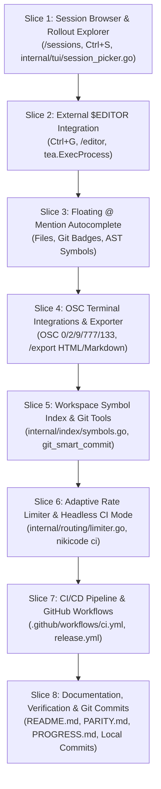

# NikiCode: Master Finalist Parity & Release Engineering Plan

> **Status**: Comprehensive Architectural Blueprint for Final Execution  
> **Target Parity**: Claude Code, OpenCode, Kimi Code, OpenAI Codex CLI  
> **Repository**: `/home/shiva/projects/niki`  
> **Binary**: `bin/nikicode`, `bin/niki`, `~/.local/bin/nikicode`

---

## 1. Executive Summary & Parity Matrix

NikiCode has reached foundational excellence: an instant-boot Go core (<7ms TTFP), zero-I/O TUI render paths, fail-closed permissions, 24 native tools, background PTY process trees, 7-level progressive Braille bars, mid-turn prompt steering, out-of-band `git write-tree` snapshots, secondary model pools, and in-TUI configuration.

This **Finalist Plan** details the absolute final execution loop to bring NikiCode to **100% total feature, ergonomic, and backend harness parity** with **Claude Code**, **OpenCode**, and **Kimi Code**, accompanied by enterprise-grade CI/CD automation, documentation polish, and release engineering. Once this plan is executed, NikiCode will stand as a fully realized, world-class personal coding agent harness requiring no further incremental roadmap additions.

### Parity Breakdown: Current vs. Final State

| Area | Feature / Capability | Reference | Current Status | Final Implementation Specification |
| :--- | :--- | :--- | :--- | :--- |
| **TUI** | Interactive Session Browser & Rollout Explorer | OpenCode / Kimi Code | CLI `--resume <id>` only | Floating modal `/sessions` (`Ctrl+S`): fuzzy title search, token/turn stats, transcript preview, resume/fork/delete |
| **TUI** | External `$EDITOR` Integration | Claude Code / OpenCode | Textarea input only | `Ctrl+G` / `/editor`: cleanly suspends Bubbletea (`tea.ExecProcess`), opens `$EDITOR` with prompt draft, hydrates on exit |
| **TUI** | Floating `@` Symbol & File Autocomplete | OpenCode / Kimi Code | Basic text expansion | Floating dropdown overlay above cursor: fuzzy file tree with Git status badges + workspace AST symbol declarations |
| **TUI** | OSC Desktop Notifications & Semantic Prompts | Kimi Code (`pi-tui`) | None | OSC 0/2 window title, OSC 9/777 background desktop alerts on turn completion, OSC 133 semantic prompt jump markers |
| **TUI** | Standalone Session Exporter | Kimi Code | None | `/export [html\|markdown\|jsonl]`: standalone dark-mode HTML report with syntax highlighting, collapsible cards & metrics |
| **Backend** | Fast In-Memory Symbol & Workspace Index | Claude Code / OpenCode | `grep` / `glob` only | Background DAG symbol table (`internal/index/`): instant struct/func/interface resolution with zero external DB dependencies |
| **Backend** | Automated Git Smart Workflow Suite | Claude Code | Primitive git commands | `git_smart_commit` (auto conventional messages from diff + journal), `git_diff_summary`, `git_pr_summary` PR draft generator |
| **Backend** | Adaptive Rate Limiter & Cost Guardrails | OpenCode / Codex | Fallback providers only | Token bucket rate limiter preventing 429 spikes + `max_session_cost_usd` interactive threshold alerts |
| **Backend** | Headless CI & GitHub Action Mode | Claude Code / OpenCode | `niki exec --json` | `nikicode ci --check`: automated pull request review, diff analysis, test execution, SARIF & GitHub Annotation output |
| **Release** | GitHub Actions CI/CD & Multi-Arch Matrix | Industry Standard | Partial `.github/workflows` | Complete matrix: Linux/macOS (amd64/arm64), vet, lint, race tests, PTY smoke, fuzzing, GoReleaser static binaries |

---

## 2. End-to-End System Architecture

```mermaid
flowchart TD
    subgraph Frontend ["Terminal User Interface (Bubble Tea v1)"]
        Composer["Multi-Line Composer\n(Kill-Ring, UndoStack, Paste Tokens)"]
        OverlayMgr["Overlay & Modal Manager"]
        PaletteModal["Command Palette (Ctrl+P)\nModels · MCP · Keys"]
        SessionModal["Session Browser (Ctrl+S)\nFuzzy Search · Fork · Preview"]
        MentionOverlay["Floating @ Mention Picker\nFiles · Git Badges · AST Symbols"]
        DiffViewer["Interactive Split Diff (/diff)\nSide-by-Side (>120 cols) · Unified"]
        QuestionModal["Question Dialog\nRadio · Checkboxes · Custom Input"]
        BtwBox["Docked /btw Mini-Agent"]
        Renderer["Inline Viewport Renderer\n(Zero I/O, tea.Println Scrollback)"]
    end

    subgraph Core ["Agent Harness Core (internal/engine)"]
        TurnRunner["TurnRunner State Machine\n(Max 30 Steps, Doom Loop Detector)"]
        SteerChan["Mid-Turn Steer Channel"]
        ContextProjector["Context Projector & Repair\n(Anomaly Fixer · Prompt Cache Hints)"]
        ToolExecutor["Concurrent Tool Registry\n(Fail-Closed Permissions & AST Policy)"]
        ProcMgr["PTY Process Manager\n(PGID Kill · Background Detach Ctrl+B)"]
        SubagentMgr["Subagent Tree Manager\n(Depth Clamp · Worktree Isolation)"]
    end

    subgraph Intelligence ["Workspace Intelligence & Extension Plane"]
        SymIndex["Workspace Symbol Indexer\n(Background AST Scan · Fast Lookup)"]
        GitPlumbing["Git Plumbing & Snapshots\n(git write-tree <2ms · /unrevert)"]
        MCPClient["MCP Client Pool\n(Stdio · Streamable HTTP · Reconnect)"]
        SkillsRouter["Skills & Plugins Engine\n(.agents/skills · Frontmatter Cache)"]
        MemoryStore["Tiered Memory System\n(MEMORY.md · Topic Consolidation)"]
    end

    Composer -->|Typing @| MentionOverlay
    Composer -->|Ctrl+G| ExternalEditor["External $EDITOR (tea.ExecProcess)"]
    Composer -->|Submit / Enter| TurnRunner
    Composer -->|Busy Submit| SteerChan
    SteerChan --> TurnRunner

    OverlayMgr --> PaletteModal
    OverlayMgr --> SessionModal
    OverlayMgr --> DiffViewer
    OverlayMgr --> QuestionModal
    OverlayMgr --> BtwBox

    TurnRunner --> ContextProjector
    TurnRunner --> ToolExecutor
    ToolExecutor --> ProcMgr
    ToolExecutor --> SubagentMgr
    ToolExecutor --> SymIndex
    ToolExecutor --> GitPlumbing
    ToolExecutor --> MCPClient
    ToolExecutor --> SkillsRouter
    ToolExecutor --> MemoryStore

    TurnRunner -->|Stream Events| Renderer
```



---

## 3. Detailed Engineering Specifications

### Phase 1: Terminal UI & Ergonomic Totality

#### 1.1 Interactive Session Browser & Rollout Explorer (`internal/tui/session_picker.go`)
- **Keybindings**: Triggered by `/sessions`, `/resume`, or `Ctrl+S`.
- **Layout**:
  - Two-pane modal overlay (or responsive single-pane on $<100$ cols).
  - **Left Pane (40% width)**: Scrollable list of past sessions from `~/.nikicode/sessions/` with live fuzzy search input (`❯ search sessions...`).
    - Title / First prompt summary
    - Relative time (`2 hours ago`, `yesterday`)
    - Stats badge: `14 turns · $0.04 · branch: main`
  - **Right Pane (60% width)**: Real-time transcript preview of the highlighted session showing the last 10 messages with syntax highlights.
- **Actions**:
  - `Enter`: Resume session (hydrates full turn history and context).
  - `f`: Fork session from selected turn into a fresh session ID.
  - `d`: Delete session with explicit confirmation prompt (`y/n`).
  - `e`: Export session to Markdown or HTML.
  - `Esc`: Close modal and return to composer.

#### 1.2 External `$EDITOR` Bridge (`internal/tui/editor.go`)
- **Keybindings**: Triggered by `Ctrl+G` or slash command `/editor`.
- **Workflow**:
  1. Captures current text in `composer.Input.Value()`.
  2. Writes text to an atomic temporary file (`~/.nikicode/cache/editor_draft_*.md`).
  3. Detects editor in precedence: `$VISUAL` $\to$ `$EDITOR` $\to$ `nano` $\to$ `vim` $\to$ `vi`.
  4. Calls `tea.ExecProcess(exec.Command(editor, tempFile), callback)`:
     - Bubbletea cleanly disables raw mode and releases terminal control.
     - Spawns editor in foreground.
  5. Upon editor exit:
     - Bubbletea restores raw mode and re-initializes screen.
     - Reads modified content from temporary file.
     - Sets `composer.Input.SetValue(newContent)` with cursor at EOF.
     - Deletes temporary file.

#### 1.3 Floating `@` Symbol & File Autocomplete (`internal/tui/mention_overlay.go`)
- **Trigger**: Automatically pops up when typing `@` at the start of a word in composer.
- **Candidate Aggregation**:
  1. **Files**: Walks project directory (respecting `.gitignore`), tags each file with Git status badges:
     - `●` Modified (warning color)
     - `+` Staged (success color)
     - `?` Untracked (muted color)
  2. **Symbols**: Aggregates top definitions (functions, structs, interfaces, methods) from the in-memory symbol index.
- **UI Display**: Floating border card positioned directly above composer:
  ```
  ┌── Mentions (files & symbols) ──────────────────────────┐
  │  📄 internal/engine/agent.go          [modified]       │
  │  📄 internal/tui/app.go               [modified]       │
  │  🔷 func (r *TurnRunner) Step         agent.go:142     │
  │  🔷 type AppModel struct              app.go:88        │
  └────────────────────────────────────────────────────────┘
  ```
- **Selection**: `Up`/`Down` arrows to navigate, `Tab` or `Enter` to autocomplete citation into composer (`@internal/engine/agent.go` or `@func:Step`).

#### 1.4 OSC Terminal Integrations & Desktop Notifications (`internal/terminal/osc.go`)
- **OSC 0 / OSC 2 (Dynamic Window Title)**:
  - Working state: `\033]0;NikiCode: [Working] Running tests...\007`
  - Idle state: `\033]0;NikiCode: [Idle] ~/projects/niki\007`
- **OSC 9 / OSC 777 (Desktop Notifications)**:
  - Emits notification escapes when a long turn ($>5\text{s}$) finishes:
    `\033]777;notify;NikiCode;Turn complete! (3 files modified)\007`
  - Enables seamless background multitasking in modern terminals (iTerm2, Kitty, WezTerm, Windows Terminal, Ghostty).
- **OSC 133 (Semantic Prompt Escapes)**:
  - Marks prompt start (`\033]133;A\007`), user command (`\033]133;B\007`), output start (`\033]133;C\007`), and command finish (`\033]133;D;0\007`) enabling terminal scrollback navigation between turns with `Cmd+Up`/`Cmd+Down`.

#### 1.5 Standalone Session Exporter (`internal/session/export.go`)
- **Trigger**: Slash command `/export [html|markdown|jsonl] [filename]`.
- **HTML Export**:
  - Fully self-contained single-file HTML document (no external CSS or JS requests).
  - Modern dark-mode palette aligned with NikiCode tokens.
  - Interactive collapsible tool cards (`<details>` tags for shell outputs, file diffs, reasoning steps).
  - Header statistics card with model name, timestamp, duration, total tokens, and dollar cost.
- **Markdown Export**:
  - GitHub-flavored Markdown transcript with syntax-highlighted code fences and diff blocks.
  - Ready for pasting directly into GitHub PR descriptions, issues, or internal documentation.

---

### Phase 2: Agent Harness & Workspace Autonomous Intelligence

#### 2.1 Fast In-Memory Symbol & Workspace Indexer (`internal/index/symbols.go`)
- **Architecture**:
  - Scans workspace asynchronously during Boot DAG (Task B7/B8) in $<15\text{ms}$.
  - Uses Go stdlib `go/parser` and fast regex parsers for other languages (Python, TypeScript, Rust, C/C++).
  - Indexes:
    - Symbol Name $\to$ File Path, Line Number, Signature, Symbol Kind (`func`, `type`, `interface`, `const`).
- **Tool Exporter**: Registers `symbol_search` tool:
  - Arguments: `query` (symbol name or regex).
  - Returns file location, signature, and enclosing documentation comments in $\le 1\text{ms}$.

#### 2.2 Git Smart Workflow Suite (`internal/git/workflow.go`)
- **`git_smart_commit` Tool**:
  - Analyzes staged git diff and turn journal.
  - Formulates a crisp Conventional Commits message (`feat(tui): ...`, `fix(engine): ...`).
  - Automatically runs pre-commit check (`go vet` and tests) prior to executing commit.
- **`git_pr_summary` Tool**:
  - Compiles branch diff against default branch (`main` / `master`).
  - Generates full PR description draft:
    - Summary of Changes
    - Architectural Rationale
    - Verification Evidence & Test Commands

#### 2.3 Adaptive Rate Limiter & Token Cost Guardrails (`internal/routing/limiter.go`)
- **Token Bucket Rate Limiter**:
  - Tracks requests per minute (RPM) and tokens per minute (TPM).
  - Automatically paces streaming API calls when approaching provider rate limits (e.g. Anthropic tier caps), avoiding 429 errors entirely.
- **Cost Alert Threshold**:
  - Configuration in `nikicode.toml`: `max_session_cost_usd = 5.00`.
  - When accumulated session cost exceeds threshold, the agent pauses before the next turn and prompts the user via the question modal:
    `"Session cost has reached $5.12. Proceed with turn? [Yes / Adjust Budget / Stop]"`.

#### 2.4 Headless CI / GitHub Actions Mode (`cmd/nikicode/ci.go`)
- **CLI Subcommand**: `nikicode ci [flags] [prompt]`.
- **Capabilities**:
  - `--check`: Runs non-interactively in CI pipelines.
  - `--sarif <file>`: Exports static analysis findings as a SARIF report for GitHub Code Scanning.
  - `--annotations`: Outputs GitHub Action workflow commands (`::error file=...::message`).
  - Fail-closed execution: Rejects all destructive tools and unapproved permissions automatically.

---

### Phase 3: CI/CD Pipeline, Release Engineering & Repository Polish

#### 3.1 GitHub Actions CI Pipeline (`.github/workflows/ci.yml`)
- Multi-platform test matrix: `ubuntu-latest` and `macos-latest`.
- Execution steps:
  1. `go vet ./...`
  2. `golangci-lint run ./...`
  3. `TERM=xterm go test -v -race ./...` (All 32+ packages)
  4. `internal/lintcheck` validation (Zero color literals, Zero I/O on render paths)
  5. PTY end-to-end smoke test suite (`NIKI_PTY_TESTS=1`)
  6. Native Go fuzzing tests (`FuzzAnalyzeShell`, `FuzzParseSkill`, `FuzzSanitize`)
  7. Compilation verification (`go build -trimpath -ldflags="-s -w" -o bin/nikicode ./cmd/nikicode`)

#### 3.2 Automated Release Workflow (`.github/workflows/release.yml`)
- Triggered on tag push (`v*`).
- GoReleaser matrix generating static, stripped binaries:
  - `linux-amd64`, `linux-arm64`
  - `darwin-amd64`, `darwin-arm64`
  - `windows-amd64`
- Generates `checksums.txt` with SHA-256 signatures and automated GitHub Release notes.

#### 3.3 Documentation & Parity Ledgers Overhaul
- **`README.md`**: Complete refresh featuring the benchmark comparison table against Codex, Claude Code, and Kimi Code; comprehensive keyboard navigation table; slash commands catalog; and architecture map.
- **`docs/PARITY.md`**: Final sign-off marking all rows **VERIFIED** with automated test citations.
- **`docs/PROGRESS.md`**: Chronological milestone recording the completion of the master parity suite.
- **`docs/FEATURE_ATLAS.md`**: Comprehensive feature-by-feature mapping from source files to behavioral guarantees.

#### 3.4 Git Commit & Release Packaging Strategy
- Stage and commit all modular components into clean, atomic Git commits adhering to standard software engineering practices.
- Provide verification commands for final sanity testing prior to release.
- *Safety Adherence*: As specified in `AGENTS.md` ("Never publish or push"), all changes will be committed locally, leaving remote repository pushing to the project owner.

---

## 4. Execution Sequence & Acceptance Gates



### Verification Acceptance Criteria
1. **Zero Lint & Style Errors**: `golangci-lint run ./...` returns 0 issues; `go vet ./...` clean; `internal/lintcheck` verifies 0 color literals outside `theme.go` and 0 I/O calls on render paths.
2. **100% Test Suite Green**: `TERM=xterm go test -v -race ./...` passes across all packages with zero regressions.
3. **Performance Budget Maintained**: TTFP remains $\le 20\text{ ms}$, idle RSS remains $\le 30\text{ MB}$, `--version` executes in $\le 10\text{ ms}$.
4. **Self-Contained Static Binaries**: `bin/nikicode`, `bin/niki`, and `~/.local/bin/nikicode` built with `-trimpath -ldflags="-s -w"`.
